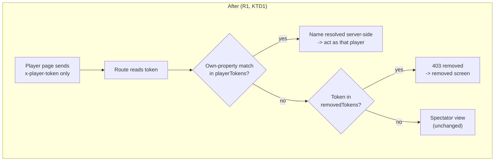
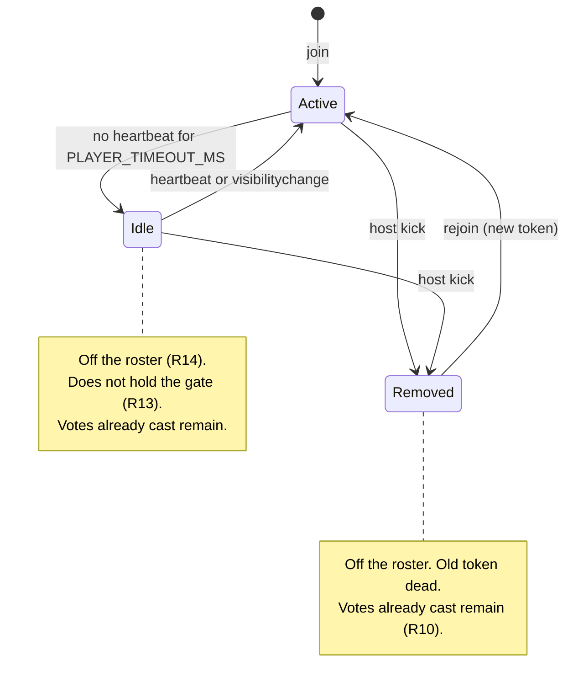
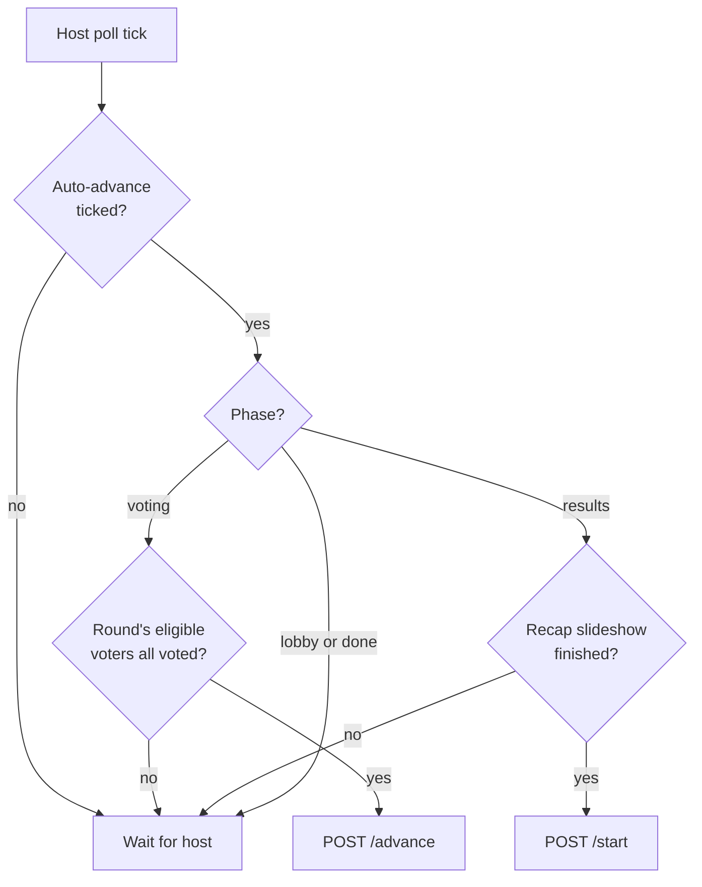

# Host Control and Input Hardening (v0.4.3) - Plan

## Goal Capsule

- **Objective:** A host can run a full [UN]Quotable night without the game stalling on someone who walked away, and every player who joins stays connected and able to vote until the champion — whatever name they typed on whatever phone.
- **Means:** Move player identity onto the token alone, give the host a kick control and an auto-advance switch, randomise the BYE, and enlarge the QR on tap (KTD1, KTD3, KTD5, KTD6).
- **Authority:** Requirements (R-IDs) win on product behavior. KTDs win on mechanism inside those requirements. Units override neither.
- **Execution profile:** One release cut, shipped as v0.4.3. All work is in `src/`; no schema change, no new dependency, no CSP change.
- **Stop conditions:** Stop and ask if a change would require editing `next.config.js` CSP, adding a dependency, altering `supabase/setup.sql`, or rotating `GAME_ENCRYPTION_KEY`.
- **Tail ownership:** This plan ends at a verified working tree. Commit, push, and release are the user's call.

---

## Product Contract

### Summary

v0.4.3 gives the host real control of the room and repairs two correctness bugs underneath it. The host can remove a player by tapping their name, tick a box to let the game advance itself, and tap the QR code to fill the screen with it. Underneath, player identity stops travelling in an HTTP header — which is what silently disconnected a player whose name contained a curly apostrophe — and the BYE stops landing on the same quote two rounds running. Helper text across the app is rewritten to the plainer register the player-standings line sets.

### Problem Frame

Three failures showed up in real play. A player joined with an apostrophe in their name and was disconnected for the rest of the game with no way back. The same quote drew the BYE in consecutive rounds, which reads as favouritism. And the host has no way to remove someone who left, so the roster fills with ghosts and the "Show Results" gate stays shut for the full five-minute activity timeout while the room waits.

The first two are not cosmetic. The name failure is unrecoverable from the player's side, and the BYE is deterministic rather than unlucky.

### Key Decisions

- **Accept any name and fix the transport, rather than restricting what a name may contain.** (session-settled: user-directed — chosen over normalising input at join or allowing only a safe character set: restricting names would refuse emoji and non-Latin names to work around a bug that belongs to the transport.) Governs R1, R2.
- **A kick is a nudge, not a ban.** (session-settled: user-directed — chosen over blocking the name for the room: among friends a removed player rejoining is not the threat model, and a name block makes a misclick unrecoverable.) Governs R7, R9.
- **Auto-advance drives both steps with no floor and no delay, including an empty room.** (session-settled: user-directed — chosen over an active-player floor or a cancellable grace countdown, and re-confirmed against retaining the existing one-active-player floor: if the room has stopped playing, finishing the bracket without them is an acceptable outcome.) Governs R11, R12.
- **A kicked player's votes stay counted.** (session-settled: user-directed — chosen over stripping their votes from the live round: the round's recorded history stays honest about what was actually cast.) Governs R10.
- **Disconnected players leave the roster at the existing activity timeout, not sooner.** (session-settled: user-directed — chosen over a shorter display-only window or greying them out: one definition of "active" keeps the visible roster and the advance gate from disagreeing.) Governs R13, R14.

### Requirements

**Player identity and names**

- R1. A player's name never travels in an HTTP header. Every authenticated player request identifies the player by token alone.
- R2. Any name a player can type into the join field works for the whole game, including emoji, curly apostrophes, accented and non-Latin characters.
- R3. A name is stored in Unicode NFC form with internal whitespace runs collapsed to single spaces, so two players cannot hold visually identical names.
- R4. A name containing no visible character after zero-width and formatting characters are removed is rejected at join with a message saying a visible name is required.
- R5. A name matching an `Object.prototype` member name (`constructor`, `toString`, `valueOf`, `hasOwnProperty`, `__proto__`) behaves like any other name for join, rejoin, voting and kick.
- R6. Existing rooms created before this release keep working through the deploy; a player's page reloads into a working session without rejoining.

**Removing a player**

- R7. The host removes a player by activating their name in the roster, after confirming in a dialog that names the player.
- R8. A removed player sees a screen stating the host removed them from the game, and their stored session for that room is cleared.
- R9. A removed player may rejoin the room, including under the same name. Rejoining issues a new session; the removed one stays dead. Because votes are recorded against the display name, a player who rejoins under the same name resumes the votes they cast before removal and stays one row in the standings.
- R10. Removing a player leaves the votes they already cast in place, so recorded round results and the end-of-game player standings are unchanged by the removal.

**Advancing the game**

- R11. A checkbox beside the round-header action lets the host hand the game forward automatically. While it is ticked the app resolves the round as soon as the round's votes are complete, and starts the next round once the results recap finishes.
- R11a. Auto-advance also resolves a round when no eligible voter remains active, so a room everyone has left runs on to the champion rather than freezing. The host's button keeps its existing meaning and stays the manual escape hatch.
- R12. The checkbox setting survives a host page reload for the same room, so a refresh does not silently change how the game behaves.
- R13. Only players active within the activity timeout, and present when the round started, hold the advance gate shut. A player who joins mid-round may vote but does not hold the gate.
- R14. The host roster shows only players active within the activity timeout. The same definition of "active" drives the roster and the advance gate.

**The BYE**

- R15. When a round has an odd number of quotes, the quote that receives the BYE is chosen at random from that round's quotes.
- R16. A quote that received the BYE in the immediately preceding round is excluded from that random choice.

**Presentation**

- R17. Activating the QR code on the host screen opens it enlarged in an overlay, dismissible by clicking away, by a close control, and by Escape.
- R18. The player-standings panel reads "How often the player voted with the majority".
- R19. Every explanatory line in the app states plainly what the reader is looking at or should do, in the register R18 sets. No user-facing copy contains a spelling error.

### Success Criteria

- A game played end to end with a player named `O’Brien 🍻` reaches the champion screen with that player's votes counted in every round.
- Across a full bracket seeded to produce a BYE in two consecutive rounds, the two BYEs go to different quotes on repeated runs.
- With auto-advance ticked, a host reaches the champion screen without pressing the round-header button after Start Game.

### Scope Boundaries

**In scope**

- The six requested changes, and the name defects the input sweep found (R3, R4, R5).

**Deferred to follow-up work**

- Adopting a test framework. The repo has none; this plan uses the compile-and-assert pattern already documented for the parser plus the existing Playwright drivers.
- Validating `sortAuthor` and stripping unknown properties from quote objects in `POST /api/game/create`. Real, reachable only by a hand-crafted request, and unrelated to the failures that prompted this cut.
- Rate limiting or authenticating `POST /api/game/[code]/join`.

**Outside this release**

- Any host undo for a kick.
- A spectator or observer mode for removed players.
- Changing `PLAYER_TIMEOUT_MS` itself.

### Acceptance Examples

- AE1. Covers R1, R2. Given a player joins as `O’Brien`, when they vote in round 1, then the vote is recorded and the player's page advances to the next matchup.
- AE2. Covers R6. Given a player joined before the deploy and their page is reloaded after it, when the page polls, then they see the live board without being sent to the join screen.
- AE3. Covers R7, R8, R9. Given the host removes `Ana` during voting, when Ana's page next polls, then Ana sees the removed screen; and when Ana rejoins as `Ana`, then she is back in the room with a new session.
- AE4. Covers R10. Given `Ana` voted in matchup 1 and is then removed, when the round resolves, then matchup 1's counts still include Ana's vote and Ana appears in the end-of-game player standings.
- AE5. Covers R13. Given a round is under way and every active player has voted, when a new player joins mid-round, then the round still resolves under auto-advance.
- AE6. Covers R15, R16. Given a five-quote field where quote Q took the BYE in round 1, when round 2 has an odd number of quotes, then the BYE goes to a quote other than Q.
- AE7. Covers R11, R12. Given auto-advance is ticked and the host reloads the page mid-game, when the round's votes complete, then the round resolves without host input.

### Sources

- `src/app/room/[code]/player/page.tsx` — poll, heartbeat and vote all set `x-player-name` from the stored name; this is the disconnect.
- `src/lib/gameLogic.ts` — `buildBracket` pads with a trailing `null`, and `advanceRound` pairs `winners[i+1] ?? null`, so the tail quote takes every later BYE.
- `src/app/api/game/[code]/route.ts` — an unrecognised player token falls through to the spectator branch and returns 200, which is why a removed player would see no signal.
- Vault: `bracketapp-conventions-and-gotchas` (release rules, Playwright invocation, production-database warning), `bracketapp-data-and-services` (an updater returning the state object unchanged skips the write).
- Verified locally: `new Headers({'x-player-name': v})` throws `TypeError` for `’`, emoji, `Ł` and CJK, and succeeds for a straight `'` and `é`. iOS smart punctuation converts a typed `'` to `’`, which is how a plain apostrophe became a fatal name.

---

## Planning Contract

### Key Technical Decisions

- KTD1. **Identify a player by token; drop `x-player-name` from the client and resolve the name server-side.** (session-settled: user-approved — chosen over percent-encoding or base64-encoding the header value: encoding leaves the name client-asserted and one forgotten call site away from the same bug, while a reverse lookup over at most 100 tokens is free.) The server finds the entry in `playerTokens` whose value matches the presented token. Instantiates the Key Decision governing R1, R2.
- KTD2. **Ignore `x-player-name` on the server rather than rejecting requests that still carry it.** A player's page loaded before the deploy keeps sending the header for up to a full game; treating its presence as an error would disconnect exactly the people this release is fixing. The compatibility runs one way only: a rollback below v0.4.3 returns 401 to every already-loaded v0.4.3 player page, because the older vote and heartbeat routes require the header. End any live room before rolling back. Governs R6.
- KTD3. **Signal removal with an explicit removed-token list in game state, not by 401-ing unknown tokens.** A stale token from an earlier room with the same code would produce a false "you were removed". A short `removedTokens` list answers the question precisely. Instantiates the Key Decision governing R7, R9.
- KTD4. **Derive the previous round's BYE from `bracketHistory` rather than storing it.** The resolved rounds already record which matchup had a null side, so R16 needs no new persisted field and no migration for rooms created before the deploy. Governs R15, R16.
- KTD5. **Snapshot the round's eligible voters when voting starts.** `allVoted` currently gates on every active player, so a mid-round joiner re-shuts a gate the room had already opened — which stalls a hands-free game. Storing the roster at `startVoting` makes the gate depend on who was present, while late joiners can still vote. Governs R13.
- KTD6. **Give `gameLogic.ts` one exported active-player predicate and use it everywhere.** The roster, `allVoted`, and the host's per-matchup vote denominators each compute "active" today. R14 makes the roster and the gate agree, and one function is what keeps them agreeing. Governs R13, R14.
- KTD7. **Treat new state fields as optional on read.** Rooms live up to 24 hours, so rooms created before the deploy will be decrypted by post-deploy code. `removedTokens` and the round-voter snapshot must both read as absent-means-empty, and absent-means-fall-back-to-active respectively. Governs R6.
- KTD8. **Key player records with own-property checks.** `playerTokens[name]` reads through the prototype chain, so a prototype-member name yields a truthy non-token value. In the join route that corrupts the staleness comparison and skips the `MAX_PLAYERS` guard; in the kick route it makes an unknown name look present. Own-property checks at every lookup fix this without changing the stored shape. Governs R5.
- KTD9. **Match each next-round bracket box by winning quote, not by position.** (session-settled: user-directed — chosen over keeping the BYE in the tail winner slot so the existing positional mapping stays true: the positional assumption is the thing R15 breaks, and encoding the randomised BYE back into a fixed slot would leave the diagram correct only by coincidence.) `BracketDiagram` derives lineage as `Math.floor(i / 2)` and repositions a lone feeder only when the odd box is last — both hold today only because the BYE always went to the tail winner. Governs R15.

### High-Level Technical Design

**Player identity, before and after.** The name stops being an input to authentication and becomes an output of it.

**Player lifecycle.** The roster and the advance gate read the same states.

**The auto-advance gate.** Three decision points, all of which already exist as host-button enablement; auto-advance fires the same action the button fires.

### Assumptions

- The player's page can resolve its own display name from its stored session, so removing the header costs the UI nothing.
- No client outside this repo calls these endpoints, so dropping a request header is not an external contract change.
- The room-code collision window makes a stale token colliding with a live room rare enough that KTD3's precision is sufficient without also versioning tokens.
- Auto-advance is driven entirely by the host page's poll tick, so a backgrounded or locked host device pauses the game until that tab is visible again.

### Implementation Constraints

- No hot reload. Restart the dev server after every change and re-verify on port 3000.
- Do not run the Playwright drivers against the Turbopack dev server — build first, then serve.
- Every Playwright run creates a real room against the production Supabase project and consumes one of ten creates per hour. Verify in batches.
- No new external origin: the QR overlay must be built from the already-rendered inline SVG, with no new asset or script host.
- Colours come from existing CSS custom properties in `src/app/globals.css`. No hard-coded hex in components.

### Sequencing

U1 unblocks everything that touches player identity. U2 and U3 both depend on it. U4 must land before U6, because auto-advance reads the gate U4 defines. U5, U7 and U8 are independent and may land in any order. U9 is last.

---

## Implementation Units

### U1. Identify players by token alone

- **Goal:** Remove `x-player-name` from every client call and resolve the player's name from the token server-side.
- **Requirements:** R1, R2, R6. Implements KTD1, KTD2, KTD8.
- **Dependencies:** none.
- **Files:** `src/lib/gameLogic.ts`, `src/lib/types.ts`, `src/app/api/game/[code]/route.ts`, `src/app/api/game/[code]/vote/route.ts`, `src/app/api/game/[code]/heartbeat/route.ts`, `src/app/room/[code]/player/page.tsx`, `_check_identity.js`
- **Approach:**
  1. Add an exported helper to `src/lib/gameLogic.ts` that maps a token to its player name using own-property iteration over `playerTokens`, returning null when unmatched (KTD8).
  2. In the poll, vote and heartbeat routes, resolve the name through that helper instead of reading `x-player-name`. Remove the header from the routes' unauthorised guards as well as their bodies — `vote` and `heartbeat` currently return 401 when `x-player-name` is missing, so leaving those guards in place would 401 every request from the moment the client stops sending it. Do not reject requests that still send it (KTD2).
  3. In `src/app/room/[code]/player/page.tsx`, drop `x-player-name` from the poll, heartbeat and vote fetch headers. The page keeps its stored name for display only.
  4. Leave `POST /api/game/[code]/join` unchanged — it already carries the name in the JSON body.
- **Patterns to follow:** the existing per-route `authError` flag set inside the `loadAndUpdate` updater, returning the state object unchanged so no write occurs.
- **Test scenarios:**
  - Compile `gameLogic.ts` and assert the token-to-name helper returns the right name for a state whose player names include `O’Brien`, `Jon 🍻`, `Łukasz`, `ゆき` and `toString`.
  - Assert the helper returns null for a token absent from `playerTokens`, and does not return a name for a token equal to an inherited `Object.prototype` value.
  - Drive a browser game with a player named `O’Brien 🍻`: join, vote in every round, reach the champion screen, and confirm the vote counts include that player each round. Covers AE1.
  - Reload a player page whose stored session predates the change and confirm it polls successfully rather than routing to the join screen. Covers AE2.
  - Confirm a request that still sends `x-player-name` with a valid token is served normally.
- **Verification:** `npx tsc --noEmit` is clean, and a full browser game with a non-Latin-1 name completes with that player's votes counted in every round.

### U2. Normalise and validate names at join

- **Goal:** Reject names with no visible character and store names in a canonical form.
- **Requirements:** R3, R4, R5. Implements KTD8.
- **Dependencies:** U1.
- **Files:** `src/lib/gameLogic.ts`, `src/app/api/game/[code]/join/route.ts`, `src/app/join/page.tsx`, `_check_identity.js`
- **Approach:**
  1. Add an exported name-normalisation function to `src/lib/gameLogic.ts`: NFC normalise, strip zero-width and formatting characters, collapse internal whitespace runs, trim, then apply the existing 24-character cap to the result.
  2. Use it in the join route before any lookup, and reject with 400 when nothing visible remains (R4).
  3. Replace every bare `playerTokens[name]` / `participants[name]` membership test in the join route with own-property checks (R5).
  4. Surface the new rejection message on the join screen through the existing 400 branch, which already renders the server's message.
- **Patterns to follow:** the existing `MAX_NAME_LEN` rejection in the join route — validate, then return a specific message with the right status.
- **Test scenarios:**
  - Normalisation maps `"  Jon   Smith "` to `"Jon Smith"`, and leaves `O’Brien 🍻` unchanged apart from NFC.
  - A name of only zero-width characters is rejected with 400 and a message naming the problem.
  - A name of `constructor` joins, rejoins with its stored token, votes, and can be removed by the host.
  - A name that is 24 characters only after normalisation is accepted, not truncated to a different name.
  - Two players typing names that differ only in whitespace runs collide on the second join with the existing name-taken message.
- **Verification:** each scenario above passes against the compiled helper, and the join screen shows a specific message for an invisible name rather than the generic name-taken text.

### U3. Kick a player from the roster

- **Goal:** Let the host remove a player, tell that player what happened, and let them rejoin.
- **Requirements:** R7, R8, R9, R10. Implements KTD3, KTD7, KTD8.
- **Dependencies:** U1.
- **Files:** `src/lib/types.ts`, `src/lib/gameLogic.ts`, `src/app/api/game/[code]/kick/route.ts`, `src/app/api/game/[code]/route.ts`, `src/app/api/game/[code]/advance/route.ts`, `src/app/room/[code]/host/page.tsx`, `src/app/room/[code]/player/page.tsx`, `src/app/globals.css`
- **Approach:**
  1. Add optional `removedTokens?: string[]` to `GameState`, read as absent-means-empty everywhere (KTD7). It is not exposed to any client — strip it alongside `hostToken` and `playerTokens` in every route that returns state to the host, which today is the poll route and `advance`.
  2. Add `POST /api/game/[code]/kick`, host-token authenticated, taking the target player name in the JSON body. Reject a body whose name is not a non-empty string with 400, mirroring the join route's guard, and resolve the target with an own-property check (KTD8) so an inherited prototype-member name reads as unknown. It deletes the player's entries from `participants` and `playerTokens`, appends the freed token to `removedTokens`, and leaves every vote array untouched (R10). An unknown name returns the state object unchanged so no write occurs. It responds `{ ok: true }` and never the state object, following `/start` and `/end` — the host repolls within 2s.
  3. In the poll route, when a presented player token is absent from `playerTokens` but present in `removedTokens`, return 403 with a machine-readable reason. Every other unmatched token keeps today's spectator behavior (KTD3).
  4. On the player page, treat that 403 as fatal: clear the room's stored session and render a screen saying the host removed them, with a route back to the join screen.
  5. On the host page, render each roster chip as a real button that opens a confirmation dialog naming the player, reusing the End Game overlay's shape and its Escape handling. Give the chip a hover and focus treatment so it reads as activatable rather than informational, and keep the dialog's confirm button out of `.btn-danger` — a kick is a nudge, not the irreversible deletion End Game warns about.
  6. Give the kick request its own pending and error state, scoped to the target player. It must not share `acting` / `actionError`, which the round-header button's label and disabled state read from — routing a kick through them would flip that button to "Resolving…" while no round is resolving.
- **Patterns to follow:** `showEndConfirm` in `src/app/room/[code]/host/page.tsx` for the overlay, its Escape listener, and the `post()` / `describeFailure()` pair for the request; the chip styling already in `src/app/globals.css`.
- **Test scenarios:**
  - The host removes a player mid-voting; that player's page shows the removed screen within one poll interval and its stored session is gone. Covers AE3.
  - The removed player rejoins under the same name and is issued a different token; the old token still gets 403. Covers AE3.
  - A player removed after voting still appears in that round's recorded counts and in the end-of-game player standings. Covers AE4.
  - Removing the only player who had not voted opens the advance gate.
  - A kick request with a valid host token and an unknown player name returns without modifying the room.
  - A kick request with a missing or wrong host token returns 401 and changes nothing.
  - A spectator holding a stale token from an unrelated room sees the spectator board, not the removed screen.
  - The confirmation dialog names the player, and dismissing it leaves them in the game.
  - The roster chip and its confirmation dialog are reachable and operable by keyboard alone.
  - A kick naming a prototype-member name such as `toString` for a player who is not in the room leaves the room unmodified.
  - A player removed after voting in matchup 1 rejoins under the same name, sees that earlier choice still recorded, and does not re-open the advance gate.
  - A kick in flight does not change the round-header button's label or disabled state.
- **Verification:** a two-player browser game in which one player is removed, sees the removed screen, rejoins under the same name, and votes again — with the removed round's counts unchanged.

### U4. One definition of an active player

- **Goal:** Make the roster and the advance gate agree, and stop a mid-round joiner from holding the gate.
- **Requirements:** R13, R14. Implements KTD5, KTD6, KTD7.
- **Dependencies:** U1.
- **Files:** `src/lib/types.ts`, `src/lib/gameLogic.ts`, `src/app/api/game/[code]/start/route.ts`, `src/app/room/[code]/host/page.tsx`, `src/app/room/[code]/player/page.tsx`
- **Approach:**
  1. Export one active-player predicate from `src/lib/gameLogic.ts` and route `allVoted`, the host roster, the host's per-matchup denominator, and the player page's `activeCount` through it (KTD6).
  2. Add optional `roundVoters?: string[]` to `GameState`, set by `startVoting` from the players active at that moment (KTD5).
  3. Gate `allVoted` on the intersection of `roundVoters` and currently-active players. When `roundVoters` is absent — a room created before the deploy — fall back to today's behavior of gating on all active players (KTD7).
  4. Keep `allVoted` false when that intersection is empty, mirroring its existing `active.length === 0` guard. It answers "has everyone voted", which an empty room cannot satisfy; R11a's empty-room behaviour is a separate condition owned by U6, so the host button's meaning does not change.
  5. Filter the host roster to active players (R14). Do not change `PLAYER_TIMEOUT_MS`.
- **Patterns to follow:** the existing `allVoted(state, now)` signature, which already takes an injectable clock.
- **Test scenarios:**
  - `allVoted` returns true when every player in `roundVoters` who is still active has voted, while a player who joined after the snapshot has not.
  - `allVoted` returns false while an active snapshot member has not voted.
  - `allVoted` on a state with no `roundVoters` behaves exactly as it does today.
  - A player who times out mid-round drops off the host roster and stops holding the gate, without their cast votes disappearing from the counts.
  - A player who joins mid-round can still cast a vote and it is counted.
  - With zero active players, `allVoted` stays false and the host button stays disabled.
  - With a mid-round joiner present but every snapshot member timed out, the intersection is empty and `allVoted` stays false.
- **Verification:** compiled assertions for each `allVoted` case pass, and in a browser game a player joining mid-round does not re-lock the "Show Results" button.

### U5. Randomise the BYE

- **Goal:** Give the BYE to a random quote each round, never the same quote twice running.
- **Requirements:** R15, R16. Implements KTD4, KTD9.
- **Dependencies:** none.
- **Files:** `src/lib/gameLogic.ts`, `src/components/BracketDiagram.tsx`, `_check_bracket.js`
- **Approach:**
  1. In `buildBracket`, place the padding `null` at a random slot rather than leaving it in the final spread position, so round 1's BYE is not deterministic.
  2. In `advanceRound`, when the winner count is odd, choose the BYE recipient at random instead of taking `winners[last]`, then pair the remaining winners in order.
  3. Exclude the previous round's BYE recipient by reading the round just resolved — the entry `advanceRound` appends to `bracketHistory`, not the last entry of `state.bracketHistory` — and finding the matchup with a null side (KTD4). The excluded set holds one quote when that round had a BYE and is empty when it did not: a round can need a BYE without the one before it having had one, as a 12-quote field does at 6 matchups, then 3, then 2. The field is always at least three when a BYE is needed, so the candidate set is non-empty either way.
  4. Keep the author-spreading behavior of `buildBracket` otherwise intact.
  5. Change `BracketDiagram` to locate each winner's next-round box by matching the winning quote rather than by `Math.floor(i / 2)`, and rework the lone-feeder repositioning that assumes the odd box is last (KTD9). The connector geometry itself is unchanged — only how a box finds its feeders.
- **Patterns to follow:** the existing `shuffle` helper in `src/lib/gameLogic.ts`.
- **Test scenarios:**
  - Over many runs of a nine-quote field, the round-1 BYE lands on more than one distinct slot.
  - For a field where round 2 and round 3 both need a BYE, the round-3 BYE is never the quote that took the round-2 BYE.
  - A field with an even count produces no BYE in round 1, exactly as today.
  - A 12-quote field, whose first BYE falls in a round the previous round did not have one, randomises without error.
  - `totalRounds` is unchanged for fields of 9, 10, 17 and 33 quotes.
  - Quotes by the same author still land in different halves of a round-1 bracket.
  - Every winner's box connects to the matchup it actually came from, on a field whose BYE is not the tail winner.
  - A bracket with a mid-array BYE renders with no crossed or orphaned connectors at desktop and phone widths.
  - A BYE matchup still resolves to the non-null side with no vote required.
- **Execution note:** this is a pure function with an existing deterministic contract; assert the invariants over many seeded runs rather than one.
- **Verification:** the compiled assertions pass, and a browser game on a nine-quote quotebook reaches a champion with the correct round count.

### U6. Auto-advance control

- **Goal:** Let the host hand the game forward automatically, and keep that setting across a reload.
- **Requirements:** R11, R11a, R12.
- **Dependencies:** U4.
- **Files:** `src/app/room/[code]/host/page.tsx`, `src/app/globals.css`
- **Approach:**
  1. Add a checkbox beside the round-header action, styled like the existing "Skip tutorial" control.
  2. Persist its value in `localStorage` under a per-room key, alongside the existing `uq_host_<CODE>` token (R12).
  3. On each poll tick, when the box is ticked, fire the same action the visible button fires: `advance` while voting once the gate is open, `start` while in results once the recap has finished. Also fire `advance` when the round's eligible voter set is empty (R11a) — a condition local to auto-advance, not to `allVoted`. Each round still plays its recap before the next starts, so an abandoned room resolves at recap pace rather than at poll pace.
  4. Guard against double-firing with a ref recording the phase and round already auto-fired. The `acting` flag cannot carry this: it is React state, so the poll callback closes over a stale value and reads false during an in-flight request.
  5. Extend the host poll effect with the same `visibilitychange` re-sync the player page already uses, so a host tab that was backgrounded resumes on return instead of waiting out a suspended timer.
  6. Leave the button visible and usable throughout.
- **Patterns to follow:** `skipTutorial` for the checkbox shape; the existing `headerAction.ready` computation, which already encodes exactly the two conditions auto-advance needs.
- **Test scenarios:**
  - With the box ticked, a round resolves without host input once the round's eligible voters have voted.
  - With the box ticked, the next round starts once the recap slideshow finishes, and not before.
  - The recap is never cut short by an auto-fired `start`.
  - A host reload mid-game restores the ticked state and auto-advance continues. Covers AE7.
  - Unticking mid-game returns control to the button immediately.
  - Two poll ticks arriving during one in-flight `advance` produce exactly one request.
  - With no active players and the box ticked, the bracket resolves on to the champion, one recap per round.
  - With no active players and the box unticked, nothing fires and the host button stays disabled.
  - Backgrounding and re-foregrounding the host tab mid-round resumes auto-advance on the next tick.
  - A game with a mid-round joiner still auto-resolves. Covers AE5.
- **Verification:** a full browser game from Start Game to champion with no host input other than ticking the box, including one page reload mid-game.

### U7. Enlarge the QR code on activation

- **Goal:** Let the host fill the screen with the join QR so players across the room can scan it.
- **Requirements:** R17.
- **Dependencies:** none.
- **Files:** `src/app/room/[code]/host/page.tsx`, `src/app/globals.css`
- **Approach:**
  1. Make the QR box an activatable control that opens an overlay containing the same `react-qr-code` component at a viewport-derived size, with the room code and join URL beneath it.
  2. Reuse the existing `.overlay` treatment and extend the host page's Escape handler to close it.
  3. Dismiss on click-away and on an explicit close control as well as Escape.
- **Patterns to follow:** the tutorial and End Game overlays in `src/app/room/[code]/host/page.tsx`, and their shared Escape effect.
- **Test scenarios:**
  - Activating the QR opens the overlay; Escape, the close control, and a click outside each dismiss it.
  - The enlarged code scans successfully from a phone at room distance.
  - The overlay is reachable and dismissible by keyboard alone.
  - Opening the overlay does not interrupt polling, and the game continues underneath.
  - At the 600px breakpoint the enlarged code still fits the viewport without clipping.
- **Verification:** the overlay is captured on the host screen at desktop and phone widths, and a phone scan from the enlarged code reaches the join page with the code pre-filled.

### U8. Helper-text pass

- **Goal:** Make every explanatory line say plainly what the reader is looking at or should do.
- **Requirements:** R18, R19.
- **Dependencies:** none.
- **Files:** `src/components/WinRankings.tsx`, `src/app/room/[code]/host/page.tsx`, `src/app/room/[code]/player/page.tsx`, `src/app/join/page.tsx`, `src/app/host/page.tsx`
- **Approach:**
  1. Set the player-standings subtitle to "How often the player voted with the majority" (R18).
  2. Read every user-facing string across the listed files and rewrite any that names a mechanism instead of a meaning, or that asks the reader to infer what a panel shows.
  3. Fix the spelling error in the tutorial overlay ("untill").
  4. Leave the two privacy paragraphs factually unchanged — they must stay true to the retention behavior in `supabase/setup.sql`.
- **Execution note:** this is a copy pass, not a behavior change. Verify by reading the rendered screens, not by unit assertions.
- **Test expectation:** none — no behavioral change. Verified by screen review.
- **Verification:** every screen is read at phone and desktop width; the standings subtitle matches R18 exactly; no spelling errors remain.

### U9. Version bump and changelog

- **Goal:** Release the cut as v0.4.3 with the three version sources in agreement.
- **Requirements:** none directly; required by the repository's release convention.
- **Dependencies:** U1, U2, U3, U4, U5, U6, U7, U8.
- **Files:** `src/app/layout.tsx`, `src/components/VersionButton.tsx`, `package.json`
- **Approach:** set `VERSION` in `src/app/layout.tsx` and the `version` field in `package.json` to `0.4.3`, and add a matching entry at the head of `HISTORY` in `src/components/VersionButton.tsx` describing this release in the voice of the existing entries. Include the rollback constraint from KTD2 so it is visible from the release notes.
- **Test expectation:** none — metadata only.
- **Verification:** the three sources read `0.4.3`, and the version modal lists the new entry at the top.

---

## Verification Contract

All commands run inside the `dev-env` container unless noted. Prefix any `docker exec` carrying an absolute container path with `MSYS_NO_PATHCONV=1`.

| Gate | Command | Applies to |
|---|---|---|
| Type check | `npx tsc --noEmit` | every unit |
| Pure-logic assertions | compile the touched `src/lib` modules with `npx tsc … --module commonjs --target es2020 --skipLibCheck` into a scratch directory outside the repo, then run the check scripts against the output | U1, U2, U4, U5 |
| Build | `npm run build` | before any browser verification |
| Serve for browser runs | `npm start` — never the Turbopack dev server | U1, U3, U6, U7 |
| Browser drivers | run from `/workspace/tools/playwright` with `PLAYWRIGHT_BROWSERS_PATH=/workspace/tools/playwright/browsers` and `PW_TIMEOUT_SCALE=1` | U1, U3, U6, U7 |
| Health | `curl -s http://localhost:3000/api/health` returns `{"status":"ok","db":"up"}` | after any route change |

**Batch the browser verification.** Each driver run creates a real room against the production Supabase project and consumes one of ten creates per hour. Plan on one run covering U1, U3, U4 and U6 together — a game with a non-Latin-1 name, a mid-round joiner, a kick, and auto-advance ticked — and call `/end` afterwards. Verify U7 on the same room's host screen.

**Restart the dev server after every change** and re-verify on port 3000; Turbopack does not observe file changes through Docker on Windows.

---

## Definition of Done

**Global**

- `npx tsc --noEmit` is clean.
- `npm run build` succeeds.
- One batched browser run reaches the champion screen and covers AE1, AE3, AE4, AE5, AE7, with `/end` called afterwards.
- All three version sources read `0.4.3` and the `HISTORY` entry is present.
- No abandoned or experimental code remains in the working tree.
- The vault notes are updated before the work is reported done: the new version, the behavior rules this release establishes with the bugs that motivated them, and every error hit with its exact text, cause and fix. Correct any note this work proved wrong rather than adding a contradicting one.

**Per unit**

| Unit | Done when |
|---|---|
| U1 | No client call sends `x-player-name`, and a game with a `’`/emoji/CJK name completes with that player's votes counted |
| U2 | An invisible name is rejected with its own message; `constructor` behaves as an ordinary name |
| U3 | A removed player sees the removed screen, rejoins under the same name, and their earlier votes still appear in the round counts and standings |
| U4 | The roster and the advance gate use one predicate, and a mid-round joiner does not re-lock the gate |
| U5 | The BYE varies across runs and never repeats on the same quote in consecutive rounds |
| U6 | A full game runs from Start Game to champion with no host input beyond the checkbox, across a reload |
| U7 | The enlarged QR opens and dismisses three ways and scans from across a room |
| U8 | The standings subtitle matches R18 exactly and no spelling errors remain on any screen |
| U9 | Version and changelog agree across all three files |
