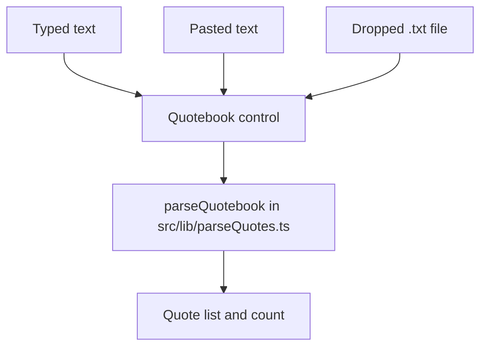

# Quotebook Text Entry and Gamefeel Motion Pass (v0.5.0)

## Goal Capsule

- **Objective:** A host can start a game from quotes they have in any form — a file, a paste, or something they type on the spot — and the room can tell what just happened in the game by looking at the screen rather than reading it.
- **Means:** Merge the file picker and a text field into one control feeding the existing parser, and add an enumerated set of 21 animated moments across the five host screens and the player stage.
- **Authority:** Requirements (R-IDs) win on product behavior. The animated set is closed: R8-R30 are the whole motion scope, and adding a moment outside them is a scope change, not polish.
- **Execution profile:** Two release cuts. v0.4.3 (the existing uncommitted player-identity fix) ships first and alone; v0.5.0 then carries this plan. All work is in `src/`; no schema change, no new dependency, no CSP change.
- **Stop conditions:** Stop and ask before editing the CSP in `next.config.js`, adding a dependency, altering `supabase/setup.sql`, or rotating `GAME_ENCRYPTION_KEY`.
- **Tail ownership:** This plan ends with v0.5.0 live on unquotable.626house.casa and `/api/health` green. Whether it *feels* more gamefied is judged by the user on the live URL.

---

## Product Contract

### Summary

v0.5.0 does two things. The host's "Add Quotebook" box becomes a single control that takes a typed, pasted, or dropped quotebook and runs all three through the same parser. And the app gains 21 named animated moments, weighted toward the host screen, with the player stage limited to transitions and vote confirmation.

### Problem Frame

Getting quotes into the game today requires a `.txt` file that already exists. A host who has quotes in a message thread, a notes app, or their head must leave the game, make a file, and come back. The box also reads as a drop target and is not one: the file input inside it is visually hidden at 1x1px in `src/app/globals.css`, so a dropped file lands on nothing and appears to be ignored.

Separately, the game looks static between the two moments it already animates. The results slideshow and the champion confetti carry the celebration; everything around them — a player joining, a vote landing, a round resolving, the bracket tightening — changes by replacing text on a 2-second poll tick. In a room watching a TV, a state change nobody sees happen does not register as an event.

### Key Decisions

- **Cut v0.4.3 before 0.5.0 begins.** (session-settled: user-directed — chosen over folding it into one 0.5.0 release: an unrecoverable player-disconnect fix should not sit uncommitted underneath new feature work.) Governs R34.
- **One control for typing, paste, and drop.** (session-settled: user-directed — chosen over keeping the dashed box and adding a separate textarea beneath it: two inputs for one job.) Governs R1, R2, R3.
- **Motion is weighted to the host screen; the player stage gets transitions only.** (session-settled: user-directed — chosen over treating the phone as the main stage: the host is a TV or laptop in a dim room, and the player page already re-renders on a 2s poll.) Governs R12-R26, R27-R30.
- **The animated set is fixed and enumerated.** (session-settled: user-directed — chosen over an open-ended sweep of every screen: a closed set is verifiable and can actually be cut.) Governs R8-R30.
- **The lobby room code spends colour hierarchy on motion.** (session-settled: user-directed — chosen over leaving gold static: the "gold means prize" discipline was surfaced as the cost and accepted.) Governs R13.
- **Reduced motion gets static end states, not a second motion design.** At 21 moments, authoring a parallel gentle-motion set doubles the surface for no stated benefit. Governs R31.

### Actors

- A1. **Host** — runs the game on a laptop or TV. Sees every screen in this plan.
- A2. **Player** — joins on a phone. Sees the player stage only.

### Requirements

**Quotebook input**

The three input paths converge on one parser:

- R1. The quotebook control accepts a quotebook typed or pasted into it as plain text, parsed by the same `parseQuotebook` path a file uses.
- R2. The control accepts a `.txt` file dropped onto it, parsed by that same path.
- R3. The control retains a keyboard-reachable file picker; its file input stays focusable and is never removed from the tab order.
- R4. Parsing runs on input change and the control reports the resulting quote count.
- R5. Input parsing to fewer than two quotes leaves the create action disabled and shows the existing shortfall message.
- R6. Typed and pasted input is held to the same caps as an uploaded file: 512 quotes, 2000 characters of quote text, 200 characters of author.
- R7. A dropped file that cannot be read as text shows the existing read-failure message and leaves no partial quote list behind.

**Host motion — setup screen**

- R8. On a successful parse the reported quote count animates from its previous value, and the control's border pulses accent once.
- R9. While a file is dragged over the page the control enlarges, its border becomes solid accent, and its background lifts; it returns to rest on drop or drag-leave.
- R10. Parsed preview rows enter in a stagger, roughly 30ms apart.
- R11. The create action sweeps the existing shimmer once at the moment it becomes enabled.

**Host motion — lobby**

- R12. A player chip entering the roster scales in from 0.8 with a slight overshoot.
- R13. The room code carries a slow gold pulse on a roughly 4-second cycle for the duration of the lobby.
- R14. The start action changes from neutral to primary with a scale bump when the roster becomes non-empty.
- R15. The joined-player count animates between values when it changes.

**Host motion — voting**

- R16. Vote bars advance with a spring rather than a linear ease, and a changed count flashes accent for roughly 150ms.
- R17. Matchup cards enter in a stagger on round start — fade and rise, roughly 60ms apart.
- R18. The active round's column in the bracket diagram carries a slow accent pulse.
- R19. When the final vote lands, the waiting alert cross-fades into the success alert and the header action bumps once.

**Host motion — results**

- R20. Result rows resolve in sequence roughly 120ms apart: the loser dims to muted as the winner moves past the arrow.
- R21. Each row's arrow draws from the loser toward the winner.
- R22. When the bracket advances a round, surviving quotes move to their new positions rather than snapping.
- R23. The "up next" matchup count animates down to its new value.

**Host motion — champion**

- R24. The champion card scales in from 0.9 with a gold bloom, the quote fades in, and the author line follows roughly 600ms later.
- R25. The two rankings panels enter staggered — authors first, players roughly 150ms behind, rows roughly 40ms apart within each — and each rate bar then fills from zero to its value, top row first.
- R26. The celebration fires the existing three bursts, then a slow confetti shower from the top edge lasting roughly 6 seconds.

**Player motion**

- R27. A phase change cross-fades the stage content over roughly 200ms.
- R28. The chosen card flashes its border accent only once the server has confirmed the vote.
- R29. A new matchup enters from the right as the previous one leaves to the left.
- R30. Personal recap rows enter in a stagger on the done screen.

**Motion posture**

- R31. Every animation in R8-R30 has a defined reduced-motion end state: under `prefers-reduced-motion: reduce` the element renders at its final value with no movement, and no confetti fires.
- R32. No animation in R8-R30 moves a transient message into or out of the document flow.
- R33. No animation in R8-R30 removes a focusable element from the tab order or changes what the page reports to assistive technology.

**Release**

- R34. v0.4.3 is committed, deployed, and verified live before any v0.5.0 code is written.
- R35. v0.5.0 bumps `VERSION` in `src/app/layout.tsx` and `version` in `package.json`, with a matching entry at the top of `HISTORY` in `src/components/VersionButton.tsx`.
- R36. v0.5.0 is live on unquotable.626house.casa with `/api/health` reporting `{"status":"ok","db":"up"}`, confirmed against a cache-busted request.

### Key Flows

- F1. Host builds a quotebook by pasting
  - **Trigger:** Host arrives at the setup screen with quotes on the clipboard.
  - **Actors:** A1
  - **Steps:** Host pastes into the control; parsing runs; the count animates to the parsed total and the border pulses; the preview staggers in; the create action unlocks and shimmers once.
  - **Outcome:** A game can be created without a file ever existing.
  - **Covered by:** R1, R4, R5, R8, R10, R11

- F2. Host builds a quotebook by dropping a file
  - **Trigger:** Host drags a `.txt` file over the page.
  - **Actors:** A1
  - **Steps:** The control enlarges and its border goes solid accent while the file is over the page; on drop the control returns to rest and the file is parsed by the same path a picked file uses.
  - **Outcome:** The box behaves the way it has always looked like it behaves.
  - **Covered by:** R2, R7, R9

- F3. A round resolves on the host screen
  - **Trigger:** Host advances past voting.
  - **Actors:** A1, A2
  - **Steps:** The slideshow runs; result rows resolve in sequence with their arrows; the bracket tweens to its new shape; the next-round count animates down. On each player's phone the stage cross-fades to the next phase.
  - **Outcome:** The room can see the field narrow without reading it.
  - **Covered by:** R20, R21, R22, R23, R27

### Acceptance Examples

- AE1. Reduced motion on the champion screen
  - **Covers:** R25, R26, R31
  - **Given:** A host machine set to `prefers-reduced-motion: reduce`.
  - **When:** The game reaches the champion screen.
  - **Then:** Both rankings panels are present with every rate bar at its final value, and no confetti fires. Nothing moves and no content is missing.

- AE2. Paste below the minimum
  - **Covers:** R1, R4, R5
  - **Given:** An empty quotebook control.
  - **When:** The host pastes a single line.
  - **Then:** The count reports one quote, the shortfall message appears, and the create action stays disabled.

- AE3. Drop of an unreadable file
  - **Covers:** R2, R7, R9
  - **Given:** The host drags a file the browser cannot read as text.
  - **When:** They release it over the control.
  - **Then:** The control returns to rest, the read-failure message appears, and no partial quote list remains.

- AE4. Vote confirmation on a slow network
  - **Covers:** R28
  - **Given:** A player taps a quote and the request is in flight.
  - **When:** The server has not yet confirmed.
  - **Then:** The card has not flashed. The flash fires only on acceptance, never on a rejected vote.

- AE5. Paste exceeding the quote cap
  - **Covers:** R6
  - **Given:** The host pastes text parsing to more than 512 quotes.
  - **When:** They attempt to create the game.
  - **Then:** The same cap behavior applies as for an oversized uploaded file.

### Success Criteria

- Every requirement in R8-R30 is observable in a screenshot or screenshot sequence taken against a production build, not the dev server.
- The parser's whole-corpus output over `quotebooks/` is unchanged before and after this release. This work adds input paths; it does not change parsing.
- v0.4.3 and v0.5.0 appear as two distinct entries in `HISTORY`, each matching the `VERSION` the deployed site reports.

### Scope Boundaries

- The four unbuilt v0.4.3 features — kick a player, auto-advance, BYE randomisation, tap-to-enlarge QR — stay parked in `docs/plans/2026-09-03-0050-feat-host-control-and-input-hardening-plan.md`.
- Two motion candidates were considered and dropped: a QR pulse until the first player joins, and a connector-line draw across the full end-of-game bracket.
- No change to the parser's grammar, to server-side handling of quotes, or to the in-app Tips table, which documents formats this plan does not alter.
- No light theme, no new colour tokens, no new dependency, no CSP change, no schema change.

### Dependencies / Assumptions

- The uncommitted player-identity work in the tree is complete and correct as v0.4.3, verified by `_check_identity.js`. This plan assumes that harness passes before the cut.
- The fireworks change is the shower alone (R26). The gold-crescendo variant discussed alongside it is not included.
- Verification runs against a production build (`npm run build && npm start`), not the Turbopack dev server, whose per-route compilation inside Docker makes browser automation unreliable.
- Local dev writes to the production Supabase project, so verification games consume the 10-creates-per-hour limit and must be batched.

### Outstanding Questions

**Deferred to Planning**

- Whether R22's bracket tween is achievable within `BracketDiagram`'s existing memoisation, which keys on bracket content only, or needs a keyed-position model. This is the largest single piece of motion work in the release and the most likely to be cut back on contact.
- Whether R16's spring is expressible in CSS or needs per-frame work, given vote counts arrive on a 2-second poll rather than continuously.
