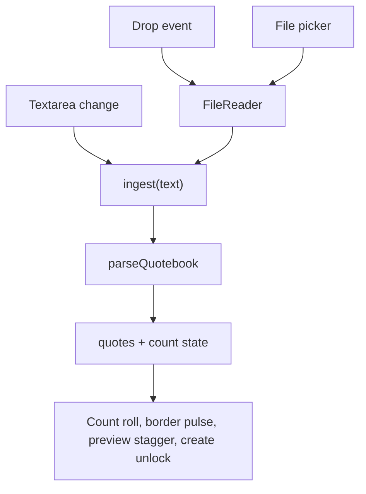
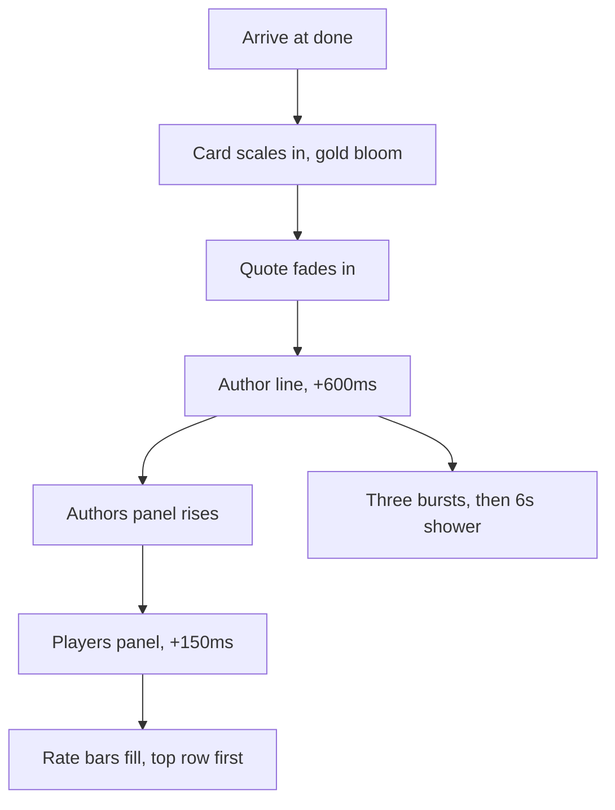

# Quotebook Text Entry and Gamefeel Motion Pass (v0.5.0)

## Goal Capsule

- **Objective:** A host can start a game from quotes they have in any form — a file, a paste, or something they type on the spot — and the room can tell what just happened in the game by looking at the screen rather than reading it.
- **Means:** Merge the file picker and a text field into one control feeding the existing parser, and add an enumerated set of 23 animated moments across the five host screens and the player stage (KTD4, KTD7).
- **Authority:** Requirements (R-IDs) win on product behavior. KTDs win on mechanism inside those requirements. Units override neither. The animated set is closed: R8-R30 are the whole motion scope, and adding a moment outside them is a scope change, not polish.
- **Execution profile:** One release cut, shipped as v0.5.0. All work is in `src/`; no schema change, no new dependency, no CSP change. v0.4.3 already shipped and is live.
- **Stop conditions:** Stop and ask before editing the CSP in `next.config.js`, adding a dependency, altering `supabase/setup.sql`, or rotating `GAME_ENCRYPTION_KEY`.
- **Tail ownership:** This plan ends at a verified working tree plus a released v0.5.0. Whether it *feels* more gamefied is judged by the user on the live URL.

**Product Contract preservation:** changed — R22. Research found bracket boxes are positioned by absolute coordinates derived from round and matchup index, so existing columns do not move when a round advances and there is no layout tween to write. R22 now specifies the new column entering with its connectors plus a smooth scroll. Confirmed with the user before this write. All other requirements unchanged; both Outstanding Questions resolved in place as KTD1 and KTD2.

---

## Product Contract

### Summary

v0.5.0 does two things. The host's "Add Quotebook" box becomes a single control that takes a typed, pasted, or dropped quotebook and runs all three through the same parser. And the app gains 23 named animated moments — weighted heavily toward the host screen, with the player stage limited to transitions and vote confirmation.

### Problem Frame

Getting quotes into the game today requires a `.txt` file that already exists. A host who has quotes in a message thread, a notes app, or their head must leave the game, make a file, and come back. The box also reads as a drop target and is not one: the file input inside it is visually hidden at 1x1px, so a dropped file lands on nothing and appears to be ignored.

Separately, the game looks static between the two moments it already animates. The results slideshow and the champion confetti carry the celebration; everything around them — a player joining, a vote landing, a round resolving, the bracket tightening — changes by replacing text on a 2-second poll tick. In a room watching a TV, a state change nobody sees happen does not register as an event.

### Key Decisions

- **Cut v0.4.3 before 0.5.0 begins.** (session-settled: user-directed — chosen over folding it into one 0.5.0 release: an unrecoverable player-disconnect fix should not sit uncommitted underneath new feature work.) Governs R34.
- **One control for typing, paste, and drop.** (session-settled: user-directed — chosen over keeping the dashed box and adding a separate textarea beneath it: two inputs for one job.) Governs R1, R2, R3.
- **Motion is weighted to the host screen; the player stage gets transitions only.** (session-settled: user-directed — chosen over treating the phone as the main stage: the host is a TV or laptop in a dim room, and the player page already re-renders on a 2s poll.) Governs R12-R26, R27-R30.
- **The animated set is fixed and enumerated.** (session-settled: user-directed — chosen over an open-ended sweep of every screen: a closed set is verifiable and can actually be cut.) Governs R8-R30.
- **The lobby room code spends colour hierarchy on motion.** (session-settled: user-directed — chosen over leaving gold static: the "gold means prize" discipline was surfaced as the cost and accepted.) Governs R13.
- **Reduced motion gets static end states, not a second motion design.** At 23 moments, authoring a parallel gentle-motion set doubles the surface for no stated benefit. Governs R31.

### Actors

- A1. **Host** — runs the game on a laptop or TV. Sees every screen in this plan.
- A2. **Player** — joins on a phone. Sees the player stage only.

### Requirements

**Quotebook input**

- R1. The quotebook control accepts a quotebook typed or pasted into it as plain text, parsed by the same `parseQuotebook` path a file uses.
- R2. The control accepts a `.txt` file dropped onto it, parsed by that same path.
- R3. The control retains a keyboard-reachable file picker; its file input stays focusable and is never removed from the tab order.
- R4. Parsing runs on input change and the control reports the resulting quote count.
- R5. Input parsing to fewer than two quotes leaves the create action disabled and shows the existing shortfall message.
- R6. Typed and pasted input is held to the same caps as an uploaded file: 512 quotes, 2000 characters of quote text, 200 characters of author.
- R7. A dropped file that cannot be read as text shows the existing read-failure message and leaves no partial quote list behind.

**Host motion — setup screen**

- R8. On a successful parse the reported quote count animates from its previous value, and the control's border pulses accent once.
- R9. While a file is dragged over the page the control enlarges, its border becomes solid accent, and its background lifts; it returns to rest on drop or drag-leave.
- R10. Parsed preview rows enter in a stagger, roughly 30ms apart.
- R11. The create action sweeps the existing shimmer once at the moment it becomes enabled.

**Host motion — lobby**

- R12. A player chip entering the roster scales in from 0.8 with a slight overshoot.
- R13. The room code carries a slow gold pulse on a roughly 4-second cycle for the duration of the lobby.
- R14. The start action changes from neutral to primary with a scale bump when the roster becomes non-empty.
- R15. The joined-player count animates between values when it changes.

**Host motion — voting**

- R16. Vote bars advance with a spring rather than a linear ease, and a changed count flashes accent for roughly 150ms.
- R17. Matchup cards enter in a stagger on round start — fade and rise, roughly 60ms apart.
- R18. The active round's column in the bracket diagram carries a slow accent pulse.
- R19. When the final vote lands, the waiting alert cross-fades into the success alert and the header action bumps once.

**Host motion — results**

- R20. Result rows resolve in sequence roughly 120ms apart: the loser dims to muted as the winner moves past the arrow.
- R21. Each row's arrow draws from the loser toward the winner.
- R22. When the bracket gains a round, the new column's boxes and connector lines enter rather than appearing instantly, and the view reaches the new column by scrolling rather than jumping. Columns already drawn keep their positions.
- R23. The "up next" matchup count animates down to its new value.

**Host motion — champion**

- R24. The champion card scales in from 0.9 with a gold bloom, the quote fades in, and the author line follows roughly 600ms later.
- R25. The two rankings panels enter staggered — authors first, players roughly 150ms behind, rows roughly 40ms apart within each — and each rate bar then fills from zero to its value, top row first.
- R26. The celebration fires the existing three bursts, then a slow confetti shower from the top edge lasting roughly 6 seconds.

**Player motion**

- R27. A phase change cross-fades the stage content over roughly 200ms.
- R28. The chosen card flashes its border accent only once the server has confirmed the vote.
- R29. A new matchup enters from the right as the previous one leaves to the left.
- R30. Personal recap rows enter in a stagger on the done screen.

**Motion posture**

- R31. Every animation in R8-R30 has a defined reduced-motion end state: under `prefers-reduced-motion: reduce` the element renders at its final value with no movement, and no confetti fires.
- R32. No animation in R8-R30 moves a transient message into or out of the document flow.
- R33. No animation in R8-R30 removes a focusable element from the tab order or changes what the page reports to assistive technology.

**Release**

- R34. v0.4.3 is committed, deployed, and verified live before any v0.5.0 code is written.
- R35. v0.5.0 bumps `VERSION` in `src/app/layout.tsx` and `version` in `package.json`, with a matching entry at the top of `HISTORY` in `src/components/VersionButton.tsx`.
- R36. v0.5.0 is live on unquotable.626house.casa with `/api/health` reporting `{"status":"ok","db":"up"}`, confirmed against a cache-busted request.

### Key Flows

- F1. Host builds a quotebook by pasting
  - **Trigger:** Host arrives at the setup screen with quotes on the clipboard.
  - **Actors:** A1
  - **Steps:** Host pastes into the control; parsing runs; the count animates to the parsed total and the border pulses; the preview staggers in; the create action unlocks and shimmers once.
  - **Outcome:** A game can be created without a file ever existing.
  - **Covered by:** R1, R4, R5, R8, R10, R11

- F2. Host builds a quotebook by dropping a file
  - **Trigger:** Host drags a `.txt` file over the page.
  - **Actors:** A1
  - **Steps:** The control enlarges and its border goes solid accent while the file is over the page; on drop the control returns to rest and the file is parsed by the same path a picked file uses.
  - **Outcome:** The box behaves the way it has always looked like it behaves.
  - **Covered by:** R2, R7, R9

- F3. A round resolves on the host screen
  - **Trigger:** Host advances past voting.
  - **Actors:** A1, A2
  - **Steps:** The slideshow runs; result rows resolve in sequence with their arrows; the bracket's new column enters and the view scrolls to it; the next-round count animates down. On each player's phone the stage cross-fades to the next phase.
  - **Outcome:** The room can see the field narrow without reading it.
  - **Covered by:** R20, R21, R22, R23, R27

### Acceptance Examples

- AE1. Reduced motion on the champion screen
  - **Covers:** R24, R25, R26, R31
  - **Given:** A host machine set to `prefers-reduced-motion: reduce`.
  - **When:** The game reaches the champion screen.
  - **Then:** Both rankings panels are present with every rate bar at its final value, and no confetti fires. Nothing moves and no content is missing.

- AE2. Paste below the minimum
  - **Covers:** R1, R4, R5
  - **Given:** An empty quotebook control.
  - **When:** The host pastes a single line.
  - **Then:** The count reports one quote, the shortfall message appears, and the create action stays disabled.

- AE3. Drop of an unreadable file
  - **Covers:** R2, R7, R9
  - **Given:** The host drags a file the browser cannot read as text.
  - **When:** They release it over the control.
  - **Then:** The control returns to rest, the read-failure message appears, and no partial quote list remains.

- AE4. Vote confirmation on a slow network
  - **Covers:** R28
  - **Given:** A player taps a quote and the request is in flight.
  - **When:** The server has not yet confirmed.
  - **Then:** The card has not flashed. The flash fires only on acceptance, never on a rejected vote.

- AE5. Paste exceeding the quote cap
  - **Covers:** R6
  - **Given:** The host pastes text parsing to more than 512 quotes.
  - **When:** They attempt to create the game.
  - **Then:** The same cap behavior applies as for an oversized uploaded file.

- AE6. Round advance on the host bracket
  - **Covers:** R22
  - **Given:** A host bracket showing rounds 1 and 2.
  - **When:** The host advances into round 3.
  - **Then:** The round-3 column and its connectors enter, the horizontal scroll animates to reveal them, and every previously drawn column keeps its coordinates.

### Success Criteria

- Every requirement in R8-R30 is observable in a screenshot or screenshot sequence taken against a production build, not the dev server.
- The parser's whole-corpus output over `quotebooks/` is unchanged before and after this release. This work adds input paths; it does not change parsing.
- v0.4.3 and v0.5.0 appear as two distinct entries in `HISTORY`, each matching the `VERSION` the deployed site reports.

### Scope Boundaries

- The four unbuilt v0.4.3 features — kick a player, auto-advance, BYE randomisation, tap-to-enlarge QR — stay parked in `docs/plans/2026-09-03-0050-feat-host-control-and-input-hardening-plan.md`, along with that plan's name-normalisation requirements, which were never implemented.
- Two motion candidates were considered and dropped: a QR pulse until the first player joins, and a connector-line draw across the full end-of-game bracket.
- No change to the parser's grammar, to server-side handling of quotes, or to the in-app Tips table, which documents formats this plan does not alter.
- No light theme, no new colour tokens, no new dependency, no CSP change, no schema change.

### Dependencies / Assumptions

- R34 is satisfied. v0.4.3 shipped as commit `65ba078`, is live, and reports `{"status":"ok","db":"up"}`.
- The fireworks change is the shower alone (R26). The gold-crescendo variant discussed alongside it is not included.
- Local dev writes to the production Supabase project, so verification games consume the 10-creates-per-hour limit and must be batched.

---

## Planning Contract

### Key Technical Decisions

- KTD1. **Bracket motion is a column entrance plus a smooth scroll, not a layout tween.** `BracketDiagram` positions every box at an absolute `x`/`y` computed from round index, matchup index and first-round count. Advancing a round appends a column and leaves every earlier column's coordinates identical, so no surviving quote has a new position to animate to. The visible discontinuity is the appearing column and the `scrollLeft = scrollWidth` jump in the existing effect. Animate those two instead. Governs R22.
- KTD2. **The vote-bar spring is a CSS transition with an overshoot easing.** `VoteBar` already sets `width` as an inline percentage and counts arrive only on the 2s poll, so a transition with a cubic-bezier whose second control point exceeds 1 produces the spring on each discrete change with no per-frame work and no new state. Governs R16.
- KTD3. **The champion screen runs one choreographed timeline, not three independent animations.** R24, R25 and R26 all fire on arrival at `done`; run them from a single mount-time sequence so the panels wait on the card and the shower starts after the reveal reads. Governs R24, R25, R26.
- KTD4. **The unified control is one drop container holding a textarea and a picker label, not one label wrapping both.** `.file-upload` becomes a plain `
`; the `<label htmlFor="quotebook">` shrinks to wrap only the browse affordance, and the clip-rect `<input type="file">` stays focusable and in the tab order. A single `<label for>` around both controls would forward every click on its 2rem of padding to the file input — a host clicking the box to type would get an OS file dialog — and would leave the textarea with no accessible name, since the label's is claimed by the input. The textarea therefore carries its own `aria-label`. `:focus-within` stays on the container as the visible focus affordance. One `ingest(text)` function is the single entry point that `FileReader.onload` and the textarea's change handler both call. Governs R1, R2, R3, R33.
- KTD5. **Drag state is tracked at the window with a counter, not on the control.** `dragenter`/`dragleave` fire for every descendant, so a naive handler flickers the highlight as the pointer crosses children. Increment on enter, decrement on leave, treat zero as rest, and reset on drop. R9 specifies the whole page as the drag surface, which this also satisfies. Governs R9.
- KTD6. **The reduced-motion contract has two halves: CSS overrides for class-driven animation, and a `matchMedia` guard for JS-driven motion.** Class-driven animations get a final-state override in the existing `prefers-reduced-motion` blocks, setting the element to its end value with `animation: none`, following the pattern `results-fill` already uses. That cannot reach motion JavaScript drives: `Confetti` draws to a canvas, and the bracket's programmatic scroll is a script call, so both need `window.matchMedia('(prefers-reduced-motion: reduce)')` checked at the callsite. A CSS-only contract would ship R31 violated on both. Governs R31.
- KTD7. **Motion is CSS classes toggled by existing state; no animation library and no new dependency.** Entrances use `animation-delay` computed from the item index via a custom property, which is how the release gets staggers without per-item JavaScript. Governs R8-R30.
- KTD8. **Verification batches into one production room create.** One scripted game driven to champion captures every host screen in a single pass. Only the setup-screen checks (R8-R11) are genuinely roomless — the reduced-motion sweep covers lobby, voting, results and champion moments and needs a game like any other, so it rides the same room rather than being budgeted as free.
- KTD10. **The just-voted card stays mounted for roughly 200ms before the next matchup arrives.** (session-settled: user-directed — chosen over flashing without the slide, and over keeping the instant advance and dropping both moments: the confirmation is worth the delay, which reads as acknowledgement rather than lag.) This reverses the optimistic immediate advance currently documented in the player page; the added latency is an accepted cost. Governs R28, R29.
- KTD11. **Setup-screen motion fires when the parsed quote count changes value, not on every input event.** (session-settled: user-directed — chosen over a ~400ms typing debounce and over animating only at the two-quote threshold: no timer to tune, and the pulse then means "another quote found", which is what the host is doing.) R4 parses on every input change, so a per-parse trigger would pulse and restagger on every keystroke once typing exists. Governs R8, R10.
- KTD9. **Result-phase and bracket motion is keyed off the slideshow finishing, not off arrival at `results`.** `/advance` sets the status and opens `ResultsSlideshow` in one commit, and `.slideshow` is `position: fixed; inset: 0; z-index: 900` over an opaque `var(--bg)` — on an eight-matchup round it covers the screen for roughly nine seconds. Motion started on arrival would run to completion unseen. U8 already applies this gate for the champion timeline; U6 and U7 use the same one. Governs R20, R21, R22, R23.

### High-Level Technical Design

Input paths converge on one ingest function, which is the only caller of the parser:

Champion-screen choreography as one timeline (KTD3):

### Assumptions

- `canvas-confetti` can drive the sustained shower with a repeating low-particle emitter rather than a new dependency; if its API cannot sustain a 6s drift cleanly, R26 falls back to a longer-lived single volley and the deviation is recorded rather than silently dropped.
- `.waiting-shimmer` is `animation: text-shimmer 2.5s linear infinite`, so R11's single sweep needs the `.shimmer-once` modifier U2 adds rather than the existing class alone.

### Sequencing

U1 and U2 are independent and can land in either order. U2 gates every motion unit after it, because it establishes where reduced-motion overrides live. U3 additionally depends on U1, since it animates the control U1 builds. U4 through U9 are mutually independent once U2 exists. U10 lands last.

---

## Implementation Units

| U-ID | Title | Key files | Depends on |
|---|---|---|---|
| U1 | Unified quotebook control | `src/app/host/page.tsx`, `src/app/globals.css` | — |
| U2 | Motion foundation and reduced-motion contract | `src/app/globals.css` | — |
| U3 | Setup screen motion | `src/app/host/page.tsx`, `src/app/globals.css` | U1, U2 |
| U4 | Lobby motion | `src/app/room/[code]/host/page.tsx`, `src/app/globals.css` | U2 |
| U5 | Voting motion | `src/components/VoteBar.tsx`, `src/app/room/[code]/host/page.tsx`, `src/app/globals.css` | U2 |
| U6 | Results row motion | `src/app/room/[code]/host/page.tsx`, `src/app/globals.css` | U2 |
| U7 | Bracket column entrance and scroll | `src/components/BracketDiagram.tsx`, `src/app/globals.css` | U2 |
| U8 | Champion choreography | `src/components/Confetti.tsx`, `src/components/WinRankings.tsx`, `src/app/room/[code]/host/page.tsx`, `src/app/globals.css` | U2 |
| U9 | Player stage motion | `src/app/room/[code]/player/page.tsx`, `src/app/globals.css` | U2 |
| U10 | Release v0.5.0 | `src/app/layout.tsx`, `package.json`, `src/components/VersionButton.tsx` | U1-U9 |

### U1. Unified quotebook control

- **Goal:** One control on the host setup screen accepts typed text, pasted text, and a dropped file, all through the existing parser.
- **Requirements:** R1, R2, R3, R4, R5, R6, R7. Covers F1, F2.
- **Dependencies:** none
- **Files:** `src/app/host/page.tsx`, `src/app/globals.css`
- **Approach:**
  1. Extract the body of the current `handleFile` reader callback into `ingest(text: string)`, which parses, sets quotes or the shortfall error, and drives the preview/tips open state.
  2. Restructure the control per KTD4: `.file-upload` becomes a plain `
` drop container; a `<textarea>` with its own `aria-label` sits above a small `<label htmlFor="quotebook">` that wraps only the browse affordance and the clip-rect `<input type="file">`. Keep `:focus-within` on the container.
  3. Store the parsed total in its own state, set on every parse including sub-minimum ones. The count today is derived from `quotes`, which a sub-minimum parse empties, so the total of 1 that R5 and AE2 require would otherwise be discarded and never displayed.
  4. Render the Create Game button unconditionally with `disabled={!hasQuotes}`. It is currently mounted only under `{hasQuotes && …}`, so "the create action stays disabled" describes a state that does not exist and no assertion can reach.
  5. Add window-level `dragenter`/`dragleave`/`dragover`/`drop` listeners with the counter from KTD5. Call `preventDefault()` on `dragover` and `drop` — without it the browser navigates away to the dropped file and the host loses everything parsed so far. `drop` reads the first file with `FileReader` and calls `ingest`.
  6. Preserve the existing `e.target.value = ''` reset so re-picking the same file re-fires.
- **Patterns to follow:** the existing `reader.onerror` handler, which clears filename and quotes together — the drop path needs the same treatment.
- **Test scenarios:**
  - Covers AE2. Pasting one line reports a count of 1, shows the shortfall message, and leaves the create action present and disabled.
  - Covers AE5. Pasting text that parses above 512 quotes behaves as an oversized file does.
  - Covers AE3. Dropping a file the browser cannot read as text shows the read-failure message and leaves `quotes` empty.
  - Typing a valid two-quote book enables the create action.
  - Pasting, then clearing the textarea, returns the control to its empty state with the create action disabled.
  - Tabbing from the page start reaches the textarea and the file input; assert on `document.activeElement`, not the `:focus-within` outline, which now lights up for either control and so cannot distinguish them.
  - A screen reader announces the textarea by its own name, and the file input's name does not include the textarea's contents.
  - Clicking the container's padding places a cursor in the textarea and does not open the file dialog.
  - Dragging a file over the page and leaving without dropping returns the control to rest exactly once, with no flicker as the pointer crosses child elements.
  - Dropping a file does not navigate the page away.
  - A file chosen through the picker still parses, proving the shared `ingest` path did not regress the original route.
- **Verification:** On a production build, all three input routes produce an identical quote count for the same content, and keyboard-only operation can reach and use the picker.

### U2. Motion foundation and reduced-motion contract

- **Goal:** The shared keyframes, the stagger convention, and the reduced-motion block structure every later motion unit writes into.
- **Requirements:** R31 (structure only — see scope note below)
- **Dependencies:** none
- **Files:** `src/app/globals.css`
- **Approach:**
  1. Add the shared entrance keyframes (rise-and-fade, scale-in-with-overshoot, accent border pulse, count-change flash).
  2. Establish the stagger convention: a `--stagger-index` custom property set inline per item, with `animation-delay: calc(var(--stagger-index) * <step>)`.
  3. Add a `.shimmer-once` modifier setting `animation-iteration-count: 1` alongside the existing `.waiting-shimmer`, which is `animation: text-shimmer 2.5s linear infinite` and would otherwise loop forever on the Create button (R11).
  4. Establish the structure of the two `prefers-reduced-motion: reduce` blocks so each later unit has a defined place to add its own final-state override, following the `results-fill` precedent (KTD6).
- **Scope note:** U2 owns the shared scaffolding, not every override. Each of U3-U9 writes the final-state override for its own animations as part of that unit's completion — U2 cannot write overrides for animations those units have not defined yet. R32 and R33 are cross-cutting constraints verified per consuming unit, not implemented here.
- **Execution note:** This is styling scaffolding with no behavioral change of its own; prove it by applying one animation from a later unit and checking its override, rather than seeking unit coverage here.
- **Test expectation:** none -- pure stylesheet scaffolding; behavior is proven by the units that consume it.
- **Verification:** The served stylesheet contains each shared keyframe, the `.shimmer-once` modifier, and both reduced-motion blocks; no rule hard-codes a hex outside the `:root` tokens.

### U3. Setup screen motion

- **Goal:** The quotebook control reacts visibly to parsing, dragging, and unlocking.
- **Requirements:** R8, R9, R10, R11. Covers F1, F2.
- **Dependencies:** U1, U2
- **Files:** `src/app/host/page.tsx`, `src/app/globals.css`
- **Approach:**
  1. R8: animate the count between values and pulse the control border once, triggered by a change in the parsed count rather than by each input event (KTD11).
  2. R9: bind the drag-state class from U1's window counter to the control's enlarged/solid-accent state.
  3. R10: set `--stagger-index` on each preview row.
  4. R11: apply `.waiting-shimmer shimmer-once` (U2) when the create action transitions from disabled to enabled.
  5. Give preview rows a key derived from their content rather than the array index. They currently use `key={i}`, so React reuses the same nodes across a second parse and the entrance never replays.
- **Patterns to follow:** `.waiting-shimmer` is applied conditionally by template string on the host page's buttons; mirror that.
- **Test scenarios:**
  - The count animates when it changes and does not re-animate when a parse yields the same total.
  - Preview rows enter in index order, and re-enter on a second parse with different content.
  - The Create button's shimmer runs one sweep and stops, rather than looping.
  - Under reduced motion the count shows its final value, the border does not pulse, and preview rows are all present.
  - Under reduced motion the control still reaches its enlarged drag state (R9) without a transition, and the create button shows no shimmer sweep (R11).
- **Verification:** Screenshot sequence of the setup screen across empty, drag-over, and parsed states.

### U4. Lobby motion

- **Goal:** The lobby shows arrivals and readiness as events.
- **Requirements:** R12, R13, R14, R15
- **Dependencies:** U2
- **Files:** `src/app/room/[code]/host/page.tsx`, `src/app/globals.css`
- **Approach:**
  1. R12: chips animate on mount. Because the 2s poll re-renders the roster constantly, the entrance must be keyed on the participant name so an existing chip does not replay its animation every tick.
  2. R13: a slow gold pulse on the room code, scoped to `status === 'lobby'` so it stops once the game starts.
  3. R14: class swap on the start action when the roster becomes non-empty.
  4. R15: animate the joined-player count on change.
- **Test scenarios:**
  - A newly joined player's chip animates once; existing chips do not re-animate across poll ticks.
  - The room code pulse stops when the game leaves the lobby.
  - The start action changes appearance at the transition from zero to one player.
  - Under reduced motion, chips appear with no scale and the room code holds a static gold.
  - Under reduced motion the start action still changes to its primary treatment without a scale bump (R14), and the joined-player count shows its final value without animating (R15).
- **Verification:** Host lobby screenshots at zero players and after a join, plus a reduced-motion capture.

### U5. Voting motion

- **Goal:** A vote landing is visible from across the room.
- **Requirements:** R16, R17, R19. R18 is also grouped under "Host motion — voting" in the Product Contract but is bracket motion and is built in U7.
- **Dependencies:** U2
- **Files:** `src/components/VoteBar.tsx`, `src/app/room/[code]/host/page.tsx`, `src/app/globals.css`
- **Approach:**
  1. R16: add the overshoot transition to `.vote-bar-fill` (KTD2) and flash the count on change.
  2. R17: `--stagger-index` on each matchup block, keyed on round so it plays once per round rather than every poll tick.
  3. R19: cross-fade the info alert into the success alert and bump the header action when `allVoted` flips true.
- **Patterns to follow:** the existing `0.3s ease` on the vote bar is the rule being replaced, not supplemented.
- **Test scenarios:**
  - A vote arriving on a poll tick springs the bar and flashes only the count that changed.
  - Matchup cards stagger once on round start and do not restagger on subsequent polls.
  - The alert cross-fade fires on the transition to all-voted, not on every poll while all-voted stays true.
  - Under reduced motion the bar moves to its new width with no overshoot and the alert swaps without a fade.
  - Under reduced motion matchup cards are all present at round start with no stagger or rise (R17).
- **Verification:** Screenshots of the voting screen mid-round and at all-voted.

### U6. Results row motion

- **Goal:** The round's outcome resolves in front of the room instead of appearing pre-decided.
- **Requirements:** R20, R21, R23
- **Dependencies:** U2
- **Files:** `src/app/room/[code]/host/page.tsx`, `src/app/globals.css`
- **Approach:**
  1. Gate all of this unit's motion on the slideshow finishing, not on arrival at `results` (KTD9). The results section renders underneath a full-screen opaque overlay for the slideshow's duration, so motion started on arrival completes unseen.
  2. R20: `--stagger-index` per result row; the loser transitions to muted while the winner translates past the arrow.
  3. R21: animate the arrow's draw, scoped to the same row delay so it reads as one motion.
  4. R23: animate the "up next" matchup count to its new value.
- **Patterns to follow:** the `!slideshowActive` condition already guarding `Confetti` on the host page is the gate shape to mirror.
- **Test scenarios:**
  - The row stagger and the count roll begin only after the slideshow finishes, and are still un-started while it is on screen.
  - Skipping the slideshow with the space bar starts the motion at that moment rather than losing it.
  - Rows resolve top to bottom in index order.
  - A BYE row, which renders null today, does not break the stagger indices of the rows around it.
  - Under reduced motion, losers are already muted and winners already positioned, with the arrow fully drawn, and the up-next count shows its final value (R23).
- **Verification:** Screenshot sequence of the results screen taken after the slideshow completes, confirming the motion is observable rather than merely implemented.

### U7. Bracket column entrance and scroll

- **Goal:** A new round arrives on the bracket visibly, and the view travels to it.
- **Requirements:** R18, R22. Covers AE6, F3.
- **Dependencies:** U2
- **Files:** `src/components/BracketDiagram.tsx`, `src/app/globals.css`
- **Approach:**
  1. Gate the entrance and the scroll on the slideshow finishing, not on arrival at `results` (KTD9) — the bracket sits under the same opaque overlay as the result rows.
  2. R22 entrance: give the newest column's `<g>` boxes and their connector lines an entrance animation, keyed on round index so only the newest column plays (KTD1).
  3. R22 scroll: change the existing `scrollLeft = scrollWidth` effect to a smooth scroll. The scroll is a script call, not a class-driven animation, so reduced motion is honoured by a `matchMedia` check at the callsite that keeps the instant jump (KTD6).
  4. R18: a slow accent pulse on the current round's column.
  5. Do not alter the `bracketKey` memo upstream or the `memo()` wrapper — both exist because participant heartbeats churn every 2s.
- **Patterns to follow:** the hooks-before-early-return ordering at the top of the component is a fixed bug; any new hook goes above the `isEmpty` return.
- **Test scenarios:**
  - Covers AE6. Advancing a round animates only the new column; earlier columns keep their coordinates.
  - The entrance begins only after the slideshow finishes, and is still un-started while it is on screen.
  - The scroll animates to the new column and still lands fully at the right edge.
  - An empty bracket still returns null without running an animation or throwing.
  - A bracket with a chained BYE, whose column can sit below the default height, animates without clipping.
  - Under reduced motion the new column is present immediately, the scroll jumps instantly, and the current-round column carries no pulse (R18).
  - The memo still suppresses re-render across a poll tick that changed only heartbeats.
- **Verification:** Screenshots of the bracket before and after a round advance, taken after the slideshow completes, plus a confirmation that the upstream memo key is unchanged.

### U8. Champion choreography

- **Goal:** The end of the game reads as one build to a payoff rather than three effects firing at once.
- **Requirements:** R24, R25, R26. Covers AE1.
- **Dependencies:** U2
- **Files:** `src/components/Confetti.tsx`, `src/components/WinRankings.tsx`, `src/app/room/[code]/host/page.tsx`, `src/app/globals.css`
- **Approach:**
  1. Drive one timeline from arrival at `done` (KTD3): card scale-and-bloom, quote fade, author at +600ms, then the panels.
  2. R25: authors panel first, players panel +150ms, rows staggered inside each, then rate bars fill from zero top-row-first.
  3. R26: keep the three existing bursts and add a sustained low-particle shower for roughly 6 seconds.
  4. `Confetti` checks `window.matchMedia('(prefers-reduced-motion: reduce)')` and returns without firing any burst or shower when it matches. It draws to a canvas from JavaScript, so no stylesheet rule can suppress it and R31's "no confetti fires" clause depends entirely on this guard (KTD6).
  5. Respect the existing suppression that holds `Confetti` back while the slideshow is active — the timeline starts when the slideshow finishes, not when `done` first appears.
- **Test scenarios:**
  - Covers AE1. Under reduced motion both panels are present with bars at final values and no confetti fires.
  - The timeline starts after the slideshow finishes, not underneath it.
  - Rate bars fill to the same values the panels report as text.
  - A game whose champion has no author skips the author beat without leaving a gap in the timeline.
  - The shower stops on its own and does not keep emitting while the host sits on the screen.
- **Verification:** Screenshot sequence across the champion reveal, plus a reduced-motion capture of the same screen.

### U9. Player stage motion

- **Goal:** The phone stage transitions instead of snapping, without becoming busy.
- **Requirements:** R27, R28, R29, R30, R32. Covers AE4.
- **Dependencies:** U2
- **Files:** `src/app/room/[code]/player/page.tsx`, `src/app/globals.css`
- **Approach:**
  1. R27: cross-fade stage content on phase change only, never on an ordinary poll tick.
  2. R28: hold the just-voted matchup mounted for roughly 200ms after the server's OK and flash its border, then advance (KTD10). The visible card is currently the first with `myVote === null`, so the optimistic update that records the OK unmounts it in the same commit; the hold is what gives the flash something to play on. Never flash before the OK, and never on a rejected vote.
  3. R29: slide the new matchup in from the right as the previous leaves left, during that same hold window.
  4. R30: stagger the recap rows on the done screen.
  5. Leave `.player-toasts` fixed-position; no new transient message may enter the document flow (R32).
- **Patterns to follow:** the existing rule that the vote only advances the UI on the server's OK — a 409 must not flash the card.
- **Test scenarios:**
  - Covers AE4. The card does not flash while the vote request is in flight, and does not flash at all on a rejected vote.
  - The next matchup arrives after the hold window, and a second vote cast during that window is not lost or double-submitted.
  - A phase change cross-fades once; a poll tick with no phase change does not.
  - The matchup slide does not shift the vote buttons under the player's thumb mid-tap.
  - A dropped-connection toast appearing or disappearing moves nothing on the page.
  - Under reduced motion, phases swap instantly and the card flash is a static border state.
  - Under reduced motion a new matchup replaces the previous one with no slide (R29), and the recap rows are all present with no stagger (R30).
- **Verification:** Player-stage screenshots across a phase change and a vote confirmation on a throttled connection.

### U10. Release v0.5.0

- **Goal:** The release ships and is verified on the live URL.
- **Requirements:** R35, R36
- **Dependencies:** U1-U9
- **Files:** `src/app/layout.tsx`, `package.json`, `src/components/VersionButton.tsx`
- **Approach:**
  1. Bump `VERSION` and `version` to `0.5.0` and add the matching `HISTORY` entry at the top, written feature-forward in plain language.
  2. Confirm all three agree before committing.
  3. Deploy, then verify with a cache-busted request (R36).
- **Execution note:** Ask the user before the production deploy.
- **Test expectation:** none -- version metadata; correctness is the deployed-site check in the Verification Contract.
- **Verification:** The live site reports `v0.5.0`, `/api/health` returns `{"status":"ok","db":"up"}`, and `/api/game/ZZZZ` returns a 404 body rather than a 500.

---

## Verification Contract

All commands run inside the `dev-env` container. Prefix any `docker exec` carrying an absolute container path with `MSYS_NO_PATHCONV=1`.

| Gate | Command | Applies to |
|---|---|---|
| Types and build | `npm run build` | every unit |
| Parser regression | recompile `src/lib/parseQuotes.ts` with `tsc` to a scratch dir outside the repo and diff whole-corpus output over `quotebooks/` | U1 |
| Browser verification | `npm run build && npm start`, then a Playwright script against the production server | U3-U9 |
| Live release | `curl -s "https://unquotable.626house.casa/?cb=$(date +%s)"` and `curl -s .../api/health` | U10 |

Rules that are not optional here:

- **Never run Playwright against the Turbopack dev server.** Per-route compilation inside Docker on a Windows bind mount takes 20-60s and reads as a product bug. Build first, then serve.
- Playwright lives at `/workspace/tools/playwright`, outside the repo, and requires `PLAYWRIGHT_BROWSERS_PATH=/workspace/tools/playwright/browsers`. If Chromium reports a missing `libnspr4.so`, its apt libs were destroyed by a container stop — reinstall with `npx playwright install-deps chromium`.
- **One room create for the whole browser pass** (KTD8). Local dev writes to the production Supabase and the limit is 10 creates per hour. Drive a single game to champion capturing every host screen, and call `/end` afterwards.
- **Only the setup-screen checks (R8-R11) need no room.** The reduced-motion sweep covers lobby, voting, results and champion moments, so it rides the same single room. Entrance animations are observable only at mount, so each host phase must be loaded with `page.emulateMedia({ reducedMotion: 'reduce' })` already set rather than toggled after load.
- Feed raw quotebook lines through `parseQuotebook` when verifying anything parser-adjacent. Scripts that POST hand-written `{text, author}` objects bypass the parser entirely.

## Definition of Done

Global:

- R34 (v0.4.3 live and verified) is a prerequisite and is already satisfied. Every requirement R1-R33 is implemented, and R35, R36 are satisfied.
- `npm run build` passes with no type errors.
- Each of the 23 motion moments has been observed on a production build, and each has a verified reduced-motion end state (R31).
- No transient message was moved into the document flow (R32); no focusable element left the tab order (R33).
- The parser's whole-corpus output over `quotebooks/` is unchanged.
- No new dependency, no CSP edit, no schema change.
- Abandoned experimental code from approaches that did not pan out is removed, not left in the diff.
- Any deviation from a requirement — including the R26 confetti fallback named in Assumptions — is recorded in the plan rather than silently absorbed.

Per unit: the unit's own Verification line holds, and its test scenarios have been exercised.
