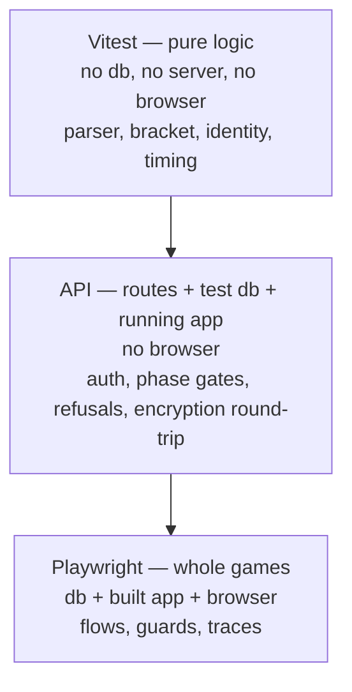
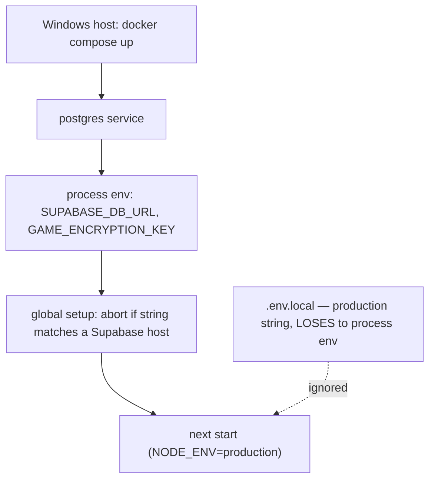

# Test Architecture

## Goal Capsule

- **Objective:** A regression in [UN]Quotable is caught by a command before anyone plays a game with it, rather than by a person noticing something missing on the live site. Bounded deliberately: a green suite means the traps this project has already hit cannot recur silently and the routes still behave — it is not a claim that any change is safe, since component rendering and pooler-dependent behaviour stay outside its reach (see Scope Boundaries).
- **Means:** Three test layers on a non-production database — pure logic, API routes, and browser — with the traps this project has already hit encoded as fixtures and standing guards (KTD1, KTD4).
- **Authority:** Requirements (R-IDs) win on what the suite must do. KTDs win on mechanism. Units override neither.
- **Execution profile:** Test infrastructure only. No production dependency is added and no application behaviour changes. `supabase/setup.sql` is split, which is the one change touching a production operational path.
- **Stop conditions:** Stop and ask before changing any file under `src/` other than to fix a defect the new tests expose, and before changing what `setup.sql` produces in production as opposed to how it is packaged. The CSP is edited **only** in the temporary, reverted way AE3 requires to prove the guard; any lasting CSP change stops and asks.
- **Tail ownership:** This plan ends with the three layers running green locally and the non-browser layers running in CI. Whether the browser layer joins CI is deferred beyond this plan.

---

## Product Contract

### Summary

[UN]Quotable has no test framework. What exists is two good assertion scripts trapped in a manual compile-to-scratch harness, and seven bespoke Playwright drivers that each rediscovered the same traps. This adds a three-layer suite — Vitest for pure logic, API tests for the routes, Playwright for whole games — on a local Postgres that no longer touches production data.

### Problem Frame

Every browser test today creates a real room in the production Supabase and burns one of ten creates per hour. That single fact shapes everything: verification had to be squeezed into one game per pass, iterating on a bug was near-impossible, and three orphaned test rooms are still sitting in the live table because a driver exited before its cleanup ran.

The pure-logic scripts are better, but reaching them means compiling `src/lib` with `tsc` into a directory outside the repo and requiring the emitted JavaScript. Stale output was run by accident more than once, and nothing aggregates results or fails a build.

The routes have never been verified by anything. Their refusals — a vote into a closed round, an action with a wrong token, a name already held — and the encrypted-state round-trip are invisible from the browser, which sees only the consequences. That gap is what the API layer answers.

Two real bugs shipped anyway, and neither was the suite's fault so much as its shape. The champion fireworks never fired on any deployed build because a CSP directive blocked the worker that draws them — silently, with the canvas still present and correct. And hours were lost to a rebuild under a running server, which serves stale chunk names that 404 back as HTML, so React never hydrates and every page looks broken in a way that reads as a product bug. Both are cheap to detect automatically and were caught by a person instead.

### Key Decisions

- **The test database comes first for anything that touches a database.** (session-settled: user-approved — proposed with its trade-offs against continuing on production Supabase, and endorsed: without it the browser layer can never run in bulk or iterate.) The pure-logic layer needs no database and may land first. Governs R1, R2, R24.
- **Motion is not verified by screenshot baseline.** Animation baselines are flaky and re-approving them costs more than they catch; binary side effects plus a retained trace serve better. Governs R18, R26.
- **Assertions are pushed down the cost ladder.** A behaviour provable in Vitest is not proved in a browser. Governs R5, R11.

### Actors

- A1. **Developer** — runs the suite locally in `dev-env` before shipping.
- A2. **CI** — runs the layers that need no browser on every push.

### Requirements

**Test database**

- R1. The suite runs against a Postgres instance that is not the production Supabase project, and running it never creates, reads, or deletes a row in production.
- R2. The suite controls its own rate-limiting state, so room creation is never refused by the application's ten-per-hour cap.
- R3. The application connects to it through the existing connection-string environment variable, with no change to `src/lib/db.ts`.
- R4. The schema the tests run against is derived from the same source as production's, so the two cannot drift.
- R5. The scheduled sweep jobs do not run against the test database.
- R6. A test run starts from a known-clean database state, and one test's rows cannot affect another's.
- R24. The connection string reaches the application through the process environment, and the suite aborts before any test if the string it resolves points at a Supabase host.
- R25. Every layer that runs the application supplies the secrets a production build demands, so no route fails for a missing key rather than a real defect.

**Pure-logic layer**

- R7. `src/lib` modules are tested directly from TypeScript, with no separate compile step and no scratch directory outside the repo.
- R8. The assertions currently in `_check_identity.js` and `_check_bracket.js` survive the move with their coverage intact, and those files are removed once they do.
- R9. Randomised behaviour is asserted over hundreds of seeded runs rather than one.
- R10. The layer runs with no database, no server, and no browser.

**API layer**

- R11. The game routes are exercised directly against the test database without a browser: creating a room, joining, the heartbeat, voting, advancing, kicking, and ending.
- R12. Authentication and phase-gate failures are asserted at their real status codes, including a vote into a closed round and an action with a wrong or absent token.
- R13. A room's encrypted state round-trips: what a route writes is what the next route reads.

**Browser layer**

- R14. A whole game can be driven from quotebook entry to champion, with a host and multiple players.
- R15. The room a browser test creates is deleted when the test finishes, including when it fails or throws.
- R16. The knowledge in the existing driver scripts — form selectors, the tutorial overlay intercepting clicks, and a vote loop that must not exit while buttons are transiently disabled — is expressed once and shared, not repeated per test.
- R17. A failing browser test retains enough evidence to diagnose it without re-running: at minimum a trace covering the failing steps.
- R26. The champion celebration is asserted to have drawn something, not merely to have produced a canvas.
- R30. The human judgement of how motion feels is made against the local production build before deploying, with the live site as confirmation rather than as the first look.

**Standing guards**

- R18. Any test fails if the page reports a Content Security Policy violation.
- R19. The browser layer refuses to run when the build being served is not the build in the tree, whether or not the version string changed.
- R20. Both guards apply to every browser test automatically, without a test opting in, including tests that do not use the game fixture.
- R31. `npm run build` refuses to run while a server from a previous build is still listening, so the staleness trap is caught during manual work and not only inside the suite.

**Running the suite**

- R21. One command runs every layer that needs no browser, and a separate command runs the browser layer.
- R22. The layers that need no browser run in CI on every push to the default branch and on every pull request.
- R23. A type error in a test file never fails `npm run build`.
- R27. Test files are typechecked by a command that is not the production build, and that command runs in CI.
- R28. A failing non-browser layer on the default branch blocks that commit deploying, enforced as a required check rather than as a convention.
- R29. The browser layer runs before any deploy, and on any change to the Content Security Policy, `next.config.js`, build configuration, or dependencies — not only when a change touches the interface.

### Key Flows

- F1. Developer runs the suite before shipping
  - **Trigger:** A change is ready to commit.
  - **Actors:** A1
  - **Steps:** One command starts the test database if needed, runs the pure-logic and API layers, and reports a single pass or fail. The browser layer is run before deploying, and whenever the change touched the CSP, `next.config.js`, build configuration or dependencies — the fireworks defect was a CSP change and would have escaped an interface-only rule. The motion judgement is made against that local build.
  - **Covered by:** R1, R7, R11, R21, R29, R30

- F2. A browser test drives a whole game
  - **Trigger:** The browser layer runs.
  - **Actors:** A1, A2
  - **Steps:** The run aborts unless the served build matches the tree; the fixture creates a room through the interface, joins players, plays rounds to a champion, and deletes the room in teardown whatever the outcome. A CSP violation at any point fails the test.
  - **Covered by:** R14, R15, R18, R19, R20

### Acceptance Examples

- AE1. Production is untouched
  - **Covers:** R1, R24
  - **Given:** A test configuration whose resolved connection string points at a Supabase host.
  - **When:** The suite starts.
  - **Then:** It aborts before any test runs, naming the host it refused. (The complementary check — that production's row count is unchanged after a run — is a manual confirmation, because the suite is forbidden from connecting to production and cannot assert it.)

- AE2. A browser test that throws still cleans up
  - **Covers:** R15
  - **Given:** A browser test that creates a room and then fails an assertion.
  - **When:** The run finishes.
  - **Then:** The room it created no longer exists in the test database.

- AE3. The CSP guard catches the fireworks class
  - **Covers:** R18, R20
  - **Given:** `worker-src` is temporarily removed from the CSP, reproducing the champion-fireworks defect.
  - **When:** Any browser test reaching the champion screen runs.
  - **Then:** It fails, naming the CSP violation — rather than passing because a canvas element exists. The CSP is restored immediately afterwards.

- AE4. The staleness guard catches the rebuild class
  - **Covers:** R19
  - **Given:** The application is rebuilt while the server from the previous build is still serving, **without** the version string changing.
  - **When:** The browser layer starts.
  - **Then:** It refuses to run and says the served build disagrees with the tree.

- AE5. A broken test does not block a deploy
  - **Covers:** R23
  - **Given:** A test file, and a test configuration file, each containing a type error.
  - **When:** `npm run build` runs.
  - **Then:** The build succeeds — and the separate typecheck command fails (R27).

- AE6. The rate limiter cannot stop a test run
  - **Covers:** R2
  - **Given:** A single test file that creates more than ten rooms.
  - **When:** It runs.
  - **Then:** Every creation succeeds.

### Success Criteria

- The suite runs repeatedly with no per-hour limit and no orphaned rooms.
- Removing `worker-src` from the CSP makes a test fail (AE3); restoring it makes it pass.
- `_check_identity.js`, `_check_bracket.js` and all seven Playwright drivers are deleted, with their assertions living in the suite.
- The non-browser layers finish in under 30 seconds in `dev-env`. Runtime is what decides whether they are actually run before every commit.
- A browser test that fails twice for a reason unrelated to the change under test is deleted rather than retried or ignored. For a one-person project the suite's real failure mode is abandonment, and a tolerated flake is how that starts.

### Scope Boundaries

- No change to application behaviour. If a new test exposes a defect, it is reported, not fixed here.
- **Pooler-dependent behaviour is out of reach.** The API layer proves route logic against plain Postgres. Production reaches its database through Supabase's transaction-mode pooler, and `withRoomLock`'s `SELECT ... FOR UPDATE` block, prepared-statement handling and connection-limit behaviour depend on that pooler. A green suite is not evidence about any of them.
- No screenshot or visual-regression baselines.
- No coverage thresholds, no lint configuration, no load or performance testing.
- No React component tests.
- The browser layer in CI is deferred (R21 covers local; R22 covers only the non-browser layers).
- **The guards may be landed early.** R18-R20 need one room, not a clean database, so if the database work stretches they can be built against the existing driver harness first — the two classes that actually shipped are then covered before the rest of the infrastructure exists.

### Dependencies / Assumptions

- Docker Compose runs on the Windows host, not inside `dev-env` — the container has no Docker socket. Container lifecycle is a host-side operation.
- Playwright 1.62.1 lives at `/workspace/tools/playwright`, outside the repo, with browsers on the bind mount reached through `PLAYWRIGHT_BROWSERS_PATH`.
- The dev-key encryption fallback covers **only** the Vitest layer. Anything running under `next start` sees `NODE_ENV=production` and must be given a real key (R25).
- `dev-env` has no `psql`; the schema and reset routine are applied through the `postgres` npm client already in the app's dependencies.

### Outstanding Questions

**Resolve Before Planning**

- None. The decisions the review surfaced are recorded below as questions for the user and are answered before U1 begins.

**Deferred to Planning**

- Whether the API layer runs against a production build or the development server in CI, and the wall-clock budget that keeps R22 tenable.
- What observed signal — flake rate, regressions caught, runtime — would later justify putting the browser layer in CI.

---

## Planning Contract

### Key Technical Decisions

- KTD1. **Local Postgres in `dev-env`, not a second Supabase project.** `src/lib/db.ts` reads `SUPABASE_DB_URL ?? DATABASE_URL` lazily and its `prepare: false, max: 1` settings are Supavisor tuning that is harmless against plain Postgres, so no application code changes. Local removes the network round-trip, is resettable, and — because the suite owns the database — lets the suite clear `rate_limits` and so escape the application's own ten-per-hour cap. **Correction:** an earlier draft justified this by claiming the scheduled sweep would race assertions. It would not: the sweep deletes rows whose `updated_at` is over 24 hours old, and every write refreshes `updated_at`. The real reason the jobs are split out is KTD2's — `create extension pg_cron` fails on a stock Postgres image. Governs R1, R2, R3, R5.
- KTD2. **Split `supabase/setup.sql` into a schema half and a cron half rather than copying the DDL.** Tests need the tables and cannot have the extension. Copying the table definitions into a test-only file guarantees drift the first time a column is added; splitting keeps one source of truth. Production runs both halves in order, and the deploy checklist changes in the same unit that retires the combined file. Governs R4, R5.
- KTD3. **Tests get their own TypeScript project, and are typechecked by their own command.** The application `tsconfig.json` today includes `**/*.ts` with only `node_modules` excluded, so every test file would be typechecked by `next build` and a broken test would block a deploy. Excluding them is what makes AE5 true — but exclusion alone would leave test files checked by *nothing*, since Vitest and Playwright transpile without typechecking, so a test referencing a renamed export would assert against `undefined` and pass. The exclusion therefore comes with `tsc -p tsconfig.test.json --noEmit` as its own command, in CI. Governs R23, R27.
- KTD4. **Three layers, and an assertion belongs on the cheapest one that can hold it.** Pure logic needs no database, server or browser; API tests need a database and a running application; browser tests need everything. Governs R5, R7, R10, R11.
- KTD5. **The guards attach for the whole run, not per fixture.** The CSP listener is an auto-use fixture hooking `context.on('page')`, so it covers pages a test opens itself and popups, not only pages the game fixture built — a guard that only covers fixture-built pages is absent from exactly the ad-hoc spec most likely to need it. The build check runs once in global setup. Governs R18, R19, R20.
- KTD6. **Motion is verified by liveness, not by baseline.** No screenshot baselines: they are flaky and re-approving them costs more than they catch. But "a canvas exists" is not evidence either — that assertion passed twice while the fireworks drew nothing. The middle option is a baseline-free liveness check: capture the canvas region mid-celebration and fail if every pixel is identical. **Correction:** an earlier draft cited `getContext` throwing `InvalidStateError` on an offscreen-transferred canvas as ruling out pixel evidence. It rules out *in-page* pixel reads only; Playwright screenshots capture composited browser output and are unaffected. Governs R17, R18, R26.
- KTD7. **The driver scripts are ported before they are deleted, and there are seven of them.** Four live at `/workspace/tools/playwright` (`_pw_v050.js`, `_pw_v060.js`, `_pw_confetti.js`, `_pw_player_check.js`, plus `_pw_winscreen.js`) and three are tracked in the app repo root (`_pw_diag.js`, `_pw_slideshow.js`, `_pw_voting.js`). `_pw_slideshow.js` is the largest and encodes the slideshow timing. They record findings that cost hours: filling `#code` and `#name` by id, ticking `#skip-tutorial` before Start Game because the tutorial overlay intercepts every later click, and driving the vote loop off whether `.player-matchup` is on screen rather than whether a button is enabled — buttons are disabled both in flight and for the 200ms confirmation hold. Governs R16.
- KTD8. **CI runs the non-browser layers, at first.** The pure-logic layer and the typecheck need nothing and finish in seconds. The API layer needs a Postgres service and a built application — a bounded cost that still gates every push, unlike the browser layer's. Governs R22, R27.
- KTD9. **The test connection string is supplied through the process environment, never a `.env` file.** `next start` forces `NODE_ENV=production`, so Next loads `.env.local` — which holds the production Supabase string — and ignores `.env.test` entirely, which is only read when `NODE_ENV` is `test`. Only the process environment outranks it. The suite therefore exports the variable in the command environment and asserts the resolved value before any route is called: guarding against a *missing* string is the wrong direction, because the hazard is a *present* one pointing at production. Governs R24.
- KTD11. **A red suite stops the deploy, and the browser layer has a trigger rather than a judgement call.** CI that reports without gating leaves the regression reaching the site and being found by a person, which is the outcome the Objective exists to remove. And a rule to run the browser layer "when the change touches the interface" would have skipped the fireworks defect, which was a CSP directive. Both guards live in that layer, so its trigger has to name the changes that carry the risk. Governs R28, R29.
- KTD12. **The build script refuses to run under a live server, rather than relying on discipline.** The staleness guard inside the browser layer only fires when that layer runs, and the hours were lost during ordinary manual rebuild-and-refresh. Detecting a listening port before building covers every path for a fraction of the cost. Governs R31.
- KTD10. **Database isolation is by serialized files, not by parallel workers.** A shared database reset by truncation only holds if one file runs at a time; Vitest and Playwright both parallelise by default, so one file's truncate would delete rows another is asserting on. Serializing is a setting; per-worker databases are a build. Governs R6.

### High-Level Technical Design

The cost ladder, and what belongs on each rung:

How the test environment is composed, and where the production string is excluded:

### Assumptions

- A Postgres service can be added to the workspace `docker-compose.yml` without disturbing the `dev-env` service or the `/workspace` bind mount. Bringing it up recreates `dev-env`, which is a host-side operation and interrupts anything running inside.
- Vitest transforms TypeScript without needing a `target` in `tsconfig.json`; the ES5 default is a typecheck concern, not a runtime one.

### Sequencing

U2 and U3 need no database and may land first — they retire the compile-to-scratch harness, which is the cheapest real win available. U1 gates U4, U5 and U6. U7 depends on U5 and U6. U8 depends on U2 and U4. U9 last.

---

## Implementation Units

### U1. Test database in dev-env

- **Goal:** A Postgres the suite can use freely, with the production project unreachable.
- **Requirements:** R1, R2, R3, R4, R5, R6, R24, R25. Implements KTD1, KTD2, KTD9, KTD10. Covers AE1, AE6.
- **Dependencies:** none
- **Files:** `docker-compose.yml` (workspace root, host-side), `supabase/schema.sql`, `supabase/cron.sql`, `supabase/setup.sql`, `tests/support/db.ts`, `.env.example`, the deploy checklist in the project vault
- **Approach:**
  1. Add a Postgres service to the workspace `docker-compose.yml`, reachable from `dev-env` by service name, with a named volume and a pinned major version. **This is a host-side operation** — PowerShell from `C:\Users\ja200\workspace`, as `start-dev.ps1` does; `dev-env` has no Docker socket. Bringing it up recreates `dev-env` and interrupts anything running inside.
  2. Split `supabase/setup.sql` into `schema.sql` (the two `create table if not exists` statements) and `cron.sql` (the `pg_cron` extension and both scheduled jobs). Retire the combined file, and **in this same unit** update the deploy checklist to name both halves in order — the checklist is the manual production runbook and must not point at a file that no longer exists.
  3. Supply `SUPABASE_DB_URL` and `GAME_ENCRYPTION_KEY` through the **process environment** of every command that starts the application (KTD9). Do not use `.env.test`: `next start` sets `NODE_ENV=production`, so Next reads `.env.local` — which holds the production string — and never reads `.env.test`.
  4. Apply the schema and implement the reset routine through the `postgres` npm client already in the app's dependencies, in `tests/support/db.ts`. There is no `psql` in the image, and installing one would be destroyed by the next `stop-dev.ps1`.
  5. Reset by truncating `game_states` **and `rate_limits`** before every test, not only between files — the ten-per-hour cap is application code keyed on the client IP, and tests send none, so every request shares the `'unknown'` key and eleven creations in one file would trip it (R2, AE6).
  6. Add a global-setup assertion that aborts the run when the resolved connection string names a Supabase host (R24, AE1).
- **Test scenarios:**
  - Covers AE1. A configuration resolving to a Supabase host aborts the run before any test, naming the host.
  - Covers AE6. A single file creating more than ten rooms succeeds throughout.
  - The schema half applies cleanly to a fresh Postgres with no `pg_cron` available, and applying it twice is safe.
  - The reset routine empties both tables and leaves the schema intact.
  - An application started by the suite reads the test connection string, not the one in `.env.local`.
  - A route that touches game state succeeds under `next start`, proving the encryption key reached it (R25).
- **Verification:** The database can be created, reset and queried from `dev-env`; `schema.sql` plus `cron.sql` together produce what `setup.sql` produced; and the deploy checklist names both.

### U2. Vitest harness and TypeScript scoping

- **Goal:** `src/lib` is testable directly from TypeScript, tests cannot break a production build, and they are still typechecked.
- **Requirements:** R7, R10, R23, R27, R31. Implements KTD3, KTD4, KTD12. Covers AE5.
- **Dependencies:** none
- **Files:** `package.json`, `vitest.config.ts`, `tsconfig.json`, `tsconfig.test.json`
- **Approach:**
  1. Add Vitest to `devDependencies` with a script for the pure-logic layer.
  2. Exclude the whole test surface from the application `tsconfig.json` — `**/*.test.ts`, `tests/**`, `vitest.config.ts`, `playwright.config.ts` — not just spec files. A type error in a config file would otherwise still block a build.
  3. Add `tsconfig.test.json` covering those same paths plus the frameworks' types, and a `typecheck:tests` script running `tsc -p tsconfig.test.json --noEmit` (R27).
  4. Set `fileParallelism: false` for any project that touches the database (KTD10).
  5. Wrap `npm run build` so it refuses while a server from a previous build is listening on the app port, naming the reason (R31, KTD12). This is the guard that covers manual work, where the hours were actually lost.
- **Execution note:** Prove AE5 in both halves before moving on — a type error in a spec file *and* in a config file must leave `npm run build` green while `typecheck:tests` goes red.
- **Test scenarios:**
  - Covers AE5. Type errors in a test file and in a test config file both leave `npm run build` green, and both fail `typecheck:tests`.
  - A trivial passing test reports success; a failing one exits non-zero.
  - The runner and the editor both resolve `@/lib/...` imports.
- **Verification:** The pure-logic script and the typecheck both run from a clean checkout in `dev-env` with no compile step and no scratch directory.

### U3. Port the compiled-assertion scripts

- **Goal:** The existing assertions live in the suite, and the scripts they came from are gone.
- **Requirements:** R8, R9. Implements KTD4.
- **Dependencies:** U2
- **Files:** `src/lib/gameLogic.test.ts`, `src/lib/parseQuotes.test.ts`, `tests/fixtures/parser/`, `_check_identity.js`, `_check_bracket.js`
- **Approach:**
  1. Port `_check_identity.js`: token-to-name resolution across apostrophes, emoji, non-Latin names and `Object.prototype` member names, plus the assertion that no authenticated path reads a player name from a header.
  2. Port `_check_bracket.js`, preserving its seeded-run discipline (R9).
  3. Carry across the two comments that record intent: that same-author quotes meeting in round 1 is deliberate and must not be "improved" away, and that the BYE sits on an even position for layout reasons.
  4. Add parser coverage using a **tracked** fixture copied into `tests/fixtures/parser/`. Do not read from `quotebooks/_testdata/` — `quotebooks/` is gitignored, so anything read from it is absent in CI and would make U8 red on its first run.
  5. Delete both scripts once their assertions pass.
- **Test scenarios:**
  - Every assertion currently in each script passes in its new home, still over hundreds of runs.
  - The parser produces the expected attribution for each line of the tracked stress fixture.
  - A player named `toString` resolves to their own token, not to a prototype function.
  - The parser fixture is tracked by git.
- **Verification:** Both scripts are deleted, and the suite fails if `playerNameForToken` or the BYE exclusion is reverted.

### U4. API-layer tests

- **Goal:** The routes are proved against a real database without a browser.
- **Requirements:** R11, R12, R13, R25. Implements KTD4.
- **Dependencies:** U1, U2
- **Files:** `tests/api/*.test.ts`, `tests/support/server.ts`
- **Approach:**
  1. Add `tests/support/server.ts` owning the lifecycle: a Vitest `globalSetup` that builds the application, spawns `next start` with the test connection string and encryption key in its process environment, polls `/api/health` until it reports `db: up`, and tears the process down afterwards. Vitest has no `webServer` option, so this is explicit work.
  2. Cover the lifecycle: create, join, heartbeat, start, vote, advance, kick, end.
  3. Cover the refusals at their real status codes — 400, 401, 404, 409 — including a vote into a resolved round, an action with a wrong or missing token, a join taking a held name, and a room that does not exist.
  4. Assert the encryption round-trip by writing through one route and reading through another.
  5. Reset the database before each test using U1's routine.
- **Test scenarios:**
  - A created room can be joined, heartbeaten, voted in, advanced, and ended.
  - A heartbeat with a missing or wrong token is refused; a valid one refreshes presence.
  - A vote into a resolved round is refused with the status the client already handles.
  - An action with a missing or wrong host token is refused and changes nothing.
  - A join under a held, active name is refused; the same name frees once that player times out.
  - A kick removes the player, leaves their cast votes counted, and lets them rejoin.
  - State written by one route is read back intact by another.
- **Verification:** The layer runs green against the test database with no browser and no production traffic.

### U5. Playwright runner and configuration

- **Goal:** The browser layer runs from a real test runner rather than bespoke scripts.
- **Requirements:** R14, R17, R21. Implements KTD6, KTD10.
- **Dependencies:** U1
- **Files:** `package.json`, `.npmrc`, `playwright.config.ts`, `tsconfig.test.json`
- **Approach:**
  1. Add `@playwright/test` to `devDependencies`, pinned to 1.62.1 to match the browsers already on the bind mount.
  2. Export `PLAYWRIGHT_BROWSERS_PATH=/workspace/tools/playwright/browsers` for **installation as well as execution** — Playwright reads it only from the environment, never from `playwright.config.ts`, and its install script otherwise downloads a second Chromium into the container filesystem, which the next `stop-dev.ps1` destroys. Record it in `.npmrc` or the npm scripts so a fresh `npm ci` here and in CI does not fetch one.
  3. Configure the application under test as a production build, never the development server.
  4. Retain a trace on failure only.
  5. Set `workers: 1` (KTD10).
- **Test scenarios:**
  - A trivial browser test loads the landing page and passes.
  - A deliberately failing test leaves a usable trace.
  - A fresh install downloads no browser into the container filesystem.
- **Verification:** The browser script runs a trivial spec against a production build, and `/root/.cache/ms-playwright` is absent afterwards.

### U6. The game fixture and the standing guards

- **Goal:** Every browser test gets a room it did not build, cleanup it cannot forget, and two guards it cannot skip.
- **Requirements:** R15, R16, R18, R19, R20, R26. Implements KTD5, KTD7. Covers AE2, AE3, AE4.
- **Dependencies:** U5
- **Files:** `tests/e2e/fixtures/game.ts`, `tests/e2e/fixtures/guards.ts`, `tests/support/db.ts`, `playwright.config.ts`
- **Approach:**
  1. Build a fixture that creates a room through the interface, joins a requested number of players, and exposes host and player pages.
  2. Delete the room in teardown unconditionally, through `tests/support/db.ts` rather than an authenticated request, so cleanup works even when the browser session is gone (AE2).
  3. Encode the driver knowledge once (KTD7): `#code` and `#name` by id; `#skip-tutorial` before Start Game; and a vote loop driven by whether a matchup is on screen.
  4. Attach the CSP listener as an **auto-use fixture hooking `context.on('page')`** for the whole run, so pages a spec opens itself are covered too (KTD5, R20).
  5. Guard staleness on the **build identity, not the version string**: compare `.next/BUILD_ID` in the tree against the `/_next/static/<buildId>/` segment in the served page's script URLs, and abort on a mismatch. A rebuild that leaves `VERSION` untouched still moves every chunk hash, which is exactly the case AE4 describes. Keep the version string only as a human-readable message.
  6. Add the liveness assertion for the celebration (R26, KTD6): capture the canvas region mid-celebration and fail if every pixel is identical.
- **Execution note:** Prove both guards by reproducing the defects they exist for — temporarily remove `worker-src` for AE3 and restore it immediately, and serve a stale build for AE4 — before relying on them.
- **Test scenarios:**
  - Covers AE2. A test that creates a room and throws leaves no room behind.
  - Covers AE3. With `worker-src` removed, a test reaching the champion screen fails naming the violation.
  - Covers AE4. A rebuild that does not change `VERSION`, served by the old process, still aborts the run.
  - A spec that opens its own page, without the game fixture, is still CSP-guarded.
  - The fixture's vote loop completes a full round rather than exiting on transiently disabled buttons.
  - The celebration's canvas is not uniformly blank mid-burst.
- **Verification:** Both guards demonstrated failing against reintroduced defects, then passing once reverted.

### U7. Port and retire the driver scripts

- **Goal:** The whole-game coverage the drivers provided lives in the suite, and all seven are gone.
- **Requirements:** R14, R16. Implements KTD7.
- **Dependencies:** U5, U6
- **Files:** `tests/e2e/*.spec.ts`; to delete — `_pw_diag.js`, `_pw_slideshow.js`, `_pw_voting.js` (app repo root) and `_pw_v050.js`, `_pw_v060.js`, `_pw_confetti.js`, `_pw_player_check.js`, `_pw_winscreen.js` (`/workspace/tools/playwright`)
- **Approach:**
  1. **Read `_pw_slideshow.js` first** — it is the largest driver and encodes the slideshow timing that U7's v0.5.0 coverage depends on.
  2. Port the v0.5.0 coverage: pasted-text parsing, the disabled create action below the minimum, the drag reaction, results motion held until the slideshow ends, and the bracket column entering.
  3. Port the v0.6.0 coverage: the QR overlay dismissing three ways, kick and rejoin, auto-advance reaching a champion with no host button presses, and the bracket rendering with finite coordinates.
  4. Port the confetti check as the liveness assertion from U6 plus the CSP guard.
  5. Delete all seven drivers once their coverage passes. The `_probe*.js` scratch files at `/workspace/tools/playwright` are throwaways and may be deleted outright.
- **Test scenarios:**
  - A whole game runs from quotebook paste to champion with a host and three players.
  - Results motion has not started while the slideshow is on screen, and has started once it ends.
  - The champion screen produces a canvas that is not blank, and no CSP violation.
  - Auto-advance reaches the champion with no host button press.
  - A kicked player sees the removal, their session is cleared, and they can rejoin.
  - The full bracket renders with no non-finite coordinate on a field that produced a BYE.
- **Verification:** All seven scripts are deleted and the suite covers what they covered, with rooms released every run.

### U8. Continuous integration

- **Goal:** The layers that need no browser gate every change.
- **Requirements:** R22, R27, R28. Implements KTD8, KTD11.
- **Dependencies:** U2, U4
- **Files:** `.github/workflows/test.yml`
- **Approach:**
  1. Run the pure-logic layer and `typecheck:tests` on pushes to the default branch and on pull requests. Neither needs a service.
  2. For the API layer, provide a Postgres service container, apply `schema.sql`, install dependencies, build the application, and supply the connection string and encryption key through the job environment — the same lifecycle `tests/support/server.ts` owns locally.
  3. Export `PLAYWRIGHT_BROWSERS_PATH` or skip the browser download in the install step, so CI does not fetch a Chromium it will not use.
  4. Do not run the browser layer (KTD8).
  5. Mark the workflow a required check on the default branch, so a red run blocks that commit deploying rather than merely reporting (R28, KTD11).
- **Test expectation:** none -- CI configuration; correctness is the workflow running green on a pull request and red when a test is broken.
- **Verification:** A pull request with a deliberately failing test is marked failed; the same branch fixed is marked passed.

### U9. Documentation

- **Goal:** The next person can run the suite without rediscovering how.
- **Requirements:** none directly; required by the project's documentation practice.
- **Dependencies:** U1-U8
- **Files:** `.env.example`, `README.md`, the project vault
- **Approach:**
  1. Document the commands, the test database, and the process-environment rule from KTD9 — including why `.env.test` does not work.
  2. Replace the vault's testing section, which describes the ad-hoc scripts and the compile-to-scratch pattern this plan removes.
  3. Keep the notes that still apply: never rebuild while the server is serving, assert randomised behaviour over many runs, and "the element exists" is not evidence for anything canvas- or worker-rendered.
  4. Record when the browser layer must run (R29) and that the motion judgement happens against the local build before deploying (R30), since both are habits the suite cannot enforce on its own.
  4. The deploy-checklist update is **not** here — it lands in U1 with the file split.
- **Test expectation:** none -- documentation.
- **Verification:** The suite can be run from the documentation alone, on a machine where it has never been run.

---

## Verification Contract

**Test commands run inside `dev-env`; container lifecycle commands run on the Windows host.** Prefix any `docker exec` carrying an absolute container path with `MSYS_NO_PATHCONV=1`.

| Gate | What it proves | Applies to |
|---|---|---|
| Pure-logic layer green | Library behaviour, over seeded runs | U2, U3 |
| `typecheck:tests` clean | Test files are type-correct without gating the build | U2, U8 |
| API layer green against the test database | Route behaviour, refusals, encryption round-trip | U4 |
| Browser layer green against a production build | Whole-game flows and both guards | U5, U6, U7 |
| `npm run build` green with a broken test and config file present | Tests cannot block a deploy (AE5) | U2 |
| Suite aborts on a Supabase connection string | The suite is off production (AE1, R24) | U1 |
| Guards fail on reintroduced defects | AE3, AE4 | U6 |

Rules that are not negotiable here:

- **Never run `npm run build` while `npm start` is serving.** It replaces the hashed chunks the running server still advertises; they 404 back as `text/html`, the browser refuses to execute them, React never hydrates, and pages look blank while handlers silently never fire. U6's build-identity guard catches this inside the suite; the discipline still applies by hand.
- **The browser layer runs against a production build, never the Turbopack development server.**
- **`PLAYWRIGHT_BROWSERS_PATH` is exported for install and for run**, or a second Chromium lands in the container filesystem and dies with the container.
- **No test may point at the production Supabase project**, and the suite proves it by refusing to start rather than by hoping.

## Deviations

Recorded here rather than silently absorbed, as the Definition of Done requires.
All were found during execution on `feat/test-architecture`, 2026-09-05.

- **U6 step 5's stated mechanism does not work.** It asks for the served build id
  from the `/_next/static/<buildId>/` segment of the page's script URLs. The App
  Router does not put it there — it carries the id in the RSC flight payload, and
  the guard reads it from there instead. A chunk-existence check would not have
  worked either: chunk filenames are content-hashed, so an unchanged source
  produces identical names and only the build id moves. The requirement (R19) is
  met; the route to it changed.

- **U5 could not reuse `tests/support/server.ts` as Playwright's `globalSetup`.**
  Playwright loads `globalSetup` in the runner process and transforms only
  statically visible dependencies, so that file's deliberate `await import()`
  calls throw `Cannot use import statement outside a module`. The lifecycle is
  re-expressed in `webServer` with the constants imported so the encryption key
  cannot drift. U4's sentinel probe was carried into U6's global setup instead.

- **U7 covers eight driver scripts, not seven.** The unit's prose says seven while
  its own `Files:` list names eight, and KTD7 says "four live at
  `/workspace/tools/playwright`" then lists five. Eight is the real number; all
  eight were ported and deleted, plus four `_probe*.js` scratch files.

- **Two driver checks were dropped as vacuous rather than ported.**
  `_pw_winscreen.js` counted `.results-wave` elements — no such class exists
  (`results-wave` is the keyframe name; the elements are `.slide-wave`), so the
  count was structurally always zero. `_pw_slideshow.js` logged
  `R2_scroll_unchanged`, which is false as an assertion: skipping the recap swaps
  in a shorter screen and the browser legitimately returns to the top. What that
  log was reaching for is asserted instead.

- **R12's status codes were wider than anticipated.** The plan named 400/401/404/409.
  The real surface also includes 403 (`reason: 'removed'` for a kicked token), 429
  (the eleventh room in an hour), and `/kick` answering 200 for a name nobody
  holds. Asserted as the code actually behaves.

- **The Success Criterion "under 30 seconds" is not met for `npm test`.** The
  non-browser layers take ~200s, of which ~190s is the `next build` that U4's
  `globalSetup` runs so the API layer can exercise a production build. The tests
  themselves take ~8s. `npm run test:unit` alone is ~3s and does meet the spirit
  of the criterion. Options, none taken unilaterally: accept it; split CI and
  local so only `test:unit` is the pre-commit gate; or cache the build on a
  source hash, which reintroduces the stale-build risk the plan is emphatic
  about. **Open for the user's decision.**

- **The suite spends seven of ten room creations per hour.** `/api/game/create` is
  capped in application code, tests send no `x-forwarded-for`, and global setup
  truncates `rate_limits` once per run — so the whole browser layer shares one
  budget of ten. Roughly three more room-taking tests will trip it, and the
  failure will look like a server fault rather than a budget.

- **R28's required-check setting is not applied.** Marking "Unit tests &
  typecheck" and "API tests (Postgres)" as required on `main` is a repository
  settings change, deliberately left for the user.

- **One application defect was found and reported rather than fixed**, per the
  plan's stop condition: `/api/game/create` answers **500** for a malformed JSON
  body while `/join`, `/vote` and `/kick` answer **400** for the same input,
  because `/create` parses inside its outer `try`. It also logs a full stack for
  what is a client error.

## Definition of Done

- Every requirement R1-R31 holds, except R22 which covers only the non-browser layers.
- `_check_identity.js`, `_check_bracket.js` and all seven `_pw_*.js` drivers are deleted, with their coverage in the suite.
- Removing `worker-src` from the CSP makes a browser test fail; restoring it makes it pass.
- A full suite run leaves no room in the production database and none in the test database.
- No production dependency was added and no file under `src/` changed except where a test exposed a defect, which was reported rather than silently fixed.
- Abandoned experimental code from approaches that did not pan out is removed, not left in the diff.
- Deviations from any requirement are recorded in this plan rather than silently absorbed.
